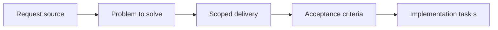

## item_019_define_ci_workflow_extension_points_for_later_delivery_and_release_automation - Define CI workflow extension points for later delivery and release automation
> From version: 0.1.1
> Status: Done
> Understanding: 94%
> Confidence: 93%
> Progress: 100%
> Complexity: Medium
> Theme: Delivery
> Reminder: Update status/understanding/confidence/progress and linked task references when you edit this doc.

# Problem
- The first CI workflow should not block future delivery work by being overly rigid.
- This slice reserves clean extension points for later deploy and release automation without overbuilding CI now.

# Scope
- In: Workflow layout, reusable job boundaries, and extension hooks for later delivery stages.
- Out: Implementing deployment, release, or preview automation itself.

# Acceptance criteria
- AC1: The request defines a GitHub Actions CI pipeline for the repository rather than a local-only validation approach.
- AC2: The CI scope remains compatible with the frontend-only static architecture and does not assume backend runtime services.
- AC3: The pipeline includes the baseline repository checks needed for this stack, such as install, lint, typecheck, and build verification, with tests included when relevant to the project state.
- AC4: The request treats lint, typecheck, tests, build verification, and Logics lint as the intended baseline mandatory checks for the initial CI workflow.
- AC5: The request treats `push` and `pull_request` as the default triggering events for the initial CI workflow.
- AC6: The CI design accounts for dependency caching suitable for the project's package-management setup.
- AC7: The CI design remains compatible with the delivery direction defined in `req_003_create_render_static_free_plan_blueprint`.
- AC8: The CI design accounts for Logics validation as part of repository quality rather than treating `logics/` as out-of-band documentation.
- AC9: The resulting pipeline foundation is suitable for later extension into deployment or release workflows without requiring a full CI redesign.

# AC Traceability
- AC1 -> Scope: Extension points live in the existing GitHub Actions workflow. Proof: `.github/workflows/ci.yml`.
- AC2 -> Scope: They remain compatible with the frontend-only static architecture. Proof: `.github/workflows/ci.yml`.
- AC3 -> Scope: Extension points sit on top of the baseline validation workflow. Proof: `.github/workflows/ci.yml`.
- AC4 -> Scope: Mandatory checks remain the base of the extension model. Proof: `.github/workflows/ci.yml`.
- AC5 -> Scope: Trigger posture remains explicit for pushes, pull requests, and manual runs. Proof: `.github/workflows/ci.yml`.
- AC6 -> Scope: Dependency caching stays part of the reusable workflow shape. Proof: `.github/workflows/ci.yml`.
- AC7 -> Scope: The workflow remains aligned with Render static delivery. Proof: `.github/workflows/ci.yml`, `render.yaml`.
- AC8 -> Scope: Logics lint stays in the main CI path. Proof: `.github/workflows/ci.yml`.
- AC9 -> Scope: Artifact upload and release-branch readiness provide clean hooks for future automation. Proof: `.github/workflows/ci.yml`.

# Decision framing
- Product framing: Not needed
- Product signals: (none detected)
- Product follow-up: No product brief follow-up is expected based on current signals.
- Architecture framing: Required
- Architecture signals: contracts and integration, delivery and operations
- Architecture follow-up: Create or link an architecture decision before irreversible implementation work starts.

# Links
- Product brief(s): (none yet)
- Architecture decision(s): (none yet)
- Request: `req_004_prepare_github_actions_ci_pipeline`
- Primary task(s): `task_015_orchestrate_static_delivery_and_ci_hardening`

# Priority
- Impact: Medium
- Urgency: Medium

# Notes
- Derived from request `req_004_prepare_github_actions_ci_pipeline`.
- Source file: `logics/request/req_004_prepare_github_actions_ci_pipeline.md`.
- Request context seeded into this backlog item from `logics/request/req_004_prepare_github_actions_ci_pipeline.md`.
- Completed in `task_015_orchestrate_static_delivery_and_ci_hardening`.
