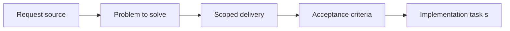

## item_020_define_asset_directory_naming_and_ownership_model_for_map_entities_and_overlays - Define asset directory naming and ownership model for map entities and overlays
> From version: 0.1.1
> Status: Done
> Understanding: 94%
> Confidence: 92%
> Progress: 100%
> Complexity: Medium
> Theme: Rendering
> Reminder: Update status/understanding/confidence/progress and linked task references when you edit this doc.

# Problem
- Map, entity, and overlay assets need clear ownership before runtime loading and replacement can scale.
- This slice defines directory structure and naming conventions so assets do not drift into a flat unowned pile.

# Scope
- In: Asset folder ownership, naming rules, and separation between map, entity, and overlay assets.
- Out: Logical sizing rules, atlas packaging, or runtime caching strategy.

# Acceptance criteria
- AC1: The request defines a dedicated asset-pipeline scope for map and entity rendering rather than mixing asset decisions implicitly into unrelated rendering requests.
- AC2: The request covers both map assets and entity assets, and distinguishes them from thin system-level overlays or debug UI assets.
- AC3: The request defines conventions for source assets and runtime-consumed assets, including at least naming, folder organization, and the expected delivery path inside the static frontend project.
- AC4: The request defines how placeholder or debug assets fit into the pipeline so early implementation can proceed without waiting for final art.
- AC5: The request defines a baseline position in which unitary placeholder assets are acceptable initially, while atlases or spritesheets remain the preferred target runtime packaging model.
- AC6: The request defines stable logical sizing expectations shared across map and entity rendering, including tile or sprite dimensions, anchors or pivots, and orientation compatibility where applicable.
- AC7: The request remains compatible with the PixiJS-based rendering stack, top-down world rendering, chunk-based map streaming, and camera pan or zoom or rotation already described in earlier requests.
- AC8: The request addresses runtime asset-loading expectations suitable for a Vite static frontend, including a compatibility stance on build-time bundling versus static asset hosting.
- AC9: The request addresses asset caching or loading behavior at a level sufficient to stay compatible with PWA static delivery and future performance work.
- AC10: The request explicitly avoids locking in final art direction, full animation production, or advanced editor tooling that belongs to later work.

# AC Traceability
- AC1 -> Scope: Asset pipeline ownership is now explicit. Proof: `src/assets/README.md`, `src/shared/config/assetPipeline.ts`.
- AC2 -> Scope: Map, entity, and overlay assets are distinct. Proof: `src/assets/README.md`, `src/assets/map`, `src/assets/entities`, `src/assets/overlays`.
- AC3 -> Scope: Folder organization and naming conventions are explicit. Proof: `src/assets/README.md`, `src/shared/config/assetPipeline.ts`.
- AC4 -> Scope: Placeholder assets have a first-class place in the pipeline. Proof: `src/assets/README.md`, `src/assets/map/placeholders/.gitkeep`, `src/assets/entities/placeholders/.gitkeep`, `src/assets/overlays/placeholders/.gitkeep`.
- AC5 -> Scope: The pipeline accepts unitary placeholders while targeting atlases later. Proof: `src/shared/config/assetPipeline.ts`, `README.md`.
- AC6 -> Scope: Stable logical sizing expectations are explicit. Proof: `src/shared/config/assetPipeline.ts`.
- AC7 -> Scope: The contract remains aligned with the existing runtime stack. Proof: `src/shared/config/assetPipeline.ts`.
- AC8 -> Scope: Runtime asset-loading posture is Vite-compatible. Proof: `src/shared/config/assetPipeline.ts`.
- AC9 -> Scope: Asset caching stays compatible with PWA/static delivery. Proof: `src/shared/config/assetPipeline.ts`, `README.md`, `render.yaml`.
- AC10 -> Scope: The slice stays structural rather than art-final. Proof: `src/assets/README.md`, `src/shared/config/assetPipeline.ts`.

# Decision framing
- Product framing: Not needed
- Product signals: (none detected)
- Product follow-up: No product brief follow-up is expected based on current signals.
- Architecture framing: Required
- Architecture signals: contracts and integration, state and sync, delivery and operations
- Architecture follow-up: Create or link an architecture decision before irreversible implementation work starts.

# Links
- Product brief(s): (none yet)
- Architecture decision(s): `adr_008_define_asset_logical_sizing_and_runtime_packaging_rules`
- Request: `req_005_define_asset_pipeline_for_map_and_entities`
- Primary task(s): `task_016_orchestrate_asset_pipeline_and_runtime_packaging_foundation`

# Priority
- Impact: Medium
- Urgency: Medium

# Notes
- Derived from request `req_005_define_asset_pipeline_for_map_and_entities`.
- Source file: `logics/request/req_005_define_asset_pipeline_for_map_and_entities.md`.
- Request context seeded into this backlog item from `logics/request/req_005_define_asset_pipeline_for_map_and_entities.md`.
- Completed in `task_016_orchestrate_asset_pipeline_and_runtime_packaging_foundation`.
