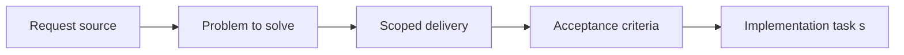

## item_021_define_logical_sizing_pivot_and_orientation_conventions_for_runtime_assets - Define logical sizing pivot and orientation conventions for runtime assets
> From version: 0.1.2
> Status: Done
> Understanding: 95%
> Confidence: 93%
> Progress: 100%
> Complexity: Medium
> Theme: Rendering
> Reminder: Update status/understanding/confidence/progress and linked task references when you edit this doc.

# Problem
- Asset rendering needs stable logical dimensions and anchors independent of source pixels.
- This slice defines pivots, sizing, and orientation conventions so map and entity visuals stay coherent under camera transforms, with a simple center-based prototype baseline where possible.

# Scope
- In: Logical tile or sprite sizing, anchor or pivot rules, and orientation conventions.
- Out: Directory ownership, atlas packaging, or PWA asset caching.

# Acceptance criteria
- AC1: The request defines a dedicated asset-pipeline scope for map and entity rendering rather than mixing asset decisions implicitly into unrelated rendering requests.
- AC2: The request covers both map assets and entity assets, and distinguishes them from thin system-level overlays or debug UI assets.
- AC3: The request defines conventions for source assets and runtime-consumed assets, including at least naming, folder organization, and the expected delivery path inside the static frontend project.
- AC4: The request defines how placeholder or debug assets fit into the pipeline so early implementation can proceed without waiting for final art.
- AC5: The request defines a baseline position in which unitary placeholder assets are acceptable initially, while atlases or spritesheets remain the preferred target runtime packaging model.
- AC6: The request defines stable logical sizing expectations shared across map and entity rendering, including tile or sprite dimensions, anchors or pivots, and orientation compatibility where applicable, with a simple center-based pivot baseline for the first prototype unless a stronger convention is justified.
- AC7: The request remains compatible with the PixiJS-based rendering stack, top-down world rendering, chunk-based map streaming, and camera pan or zoom or rotation already described in earlier requests.
- AC8: The request addresses runtime asset-loading expectations suitable for a Vite static frontend, including a compatibility stance on build-time bundling versus static asset hosting.
- AC9: The request addresses asset caching or loading behavior at a level sufficient to stay compatible with PWA static delivery and future performance work.
- AC10: The request explicitly avoids locking in final art direction, full animation production, or advanced editor tooling that belongs to later work.

# AC Traceability
- AC1 -> Scope: Sizing and pivot rules live inside the asset pipeline contract. Proof: `src/shared/config/assetPipeline.ts`.
- AC2 -> Scope: The rules cover map, entity, and overlay domains. Proof: `src/shared/config/assetPipeline.ts`.
- AC3 -> Scope: The contract keeps sizing and pivots tied to runtime conventions. Proof: `src/shared/config/assetPipeline.ts`.
- AC4 -> Scope: Placeholder assets follow the same logical rules. Proof: `src/shared/config/assetPipeline.ts`, `src/assets/README.md`.
- AC5 -> Scope: Placeholder-first and atlas-target packaging remain compatible with the same sizing contract. Proof: `src/shared/config/assetPipeline.ts`.
- AC6 -> Scope: Tile size, sprite size, pivots, and default facing are explicit. Proof: `src/shared/config/assetPipeline.ts`.
- AC7 -> Scope: The conventions stay compatible with the PixiJS top-down runtime. Proof: `src/shared/config/assetPipeline.ts`.
- AC8 -> Scope: The contract stays Vite/static-delivery friendly. Proof: `src/shared/config/assetPipeline.ts`.
- AC9 -> Scope: The rules remain compatible with PWA delivery. Proof: `src/shared/config/assetPipeline.ts`, `README.md`.
- AC10 -> Scope: The slice avoids final-art lock-in. Proof: `src/shared/config/assetPipeline.ts`.

# Decision framing
- Product framing: Not needed
- Product signals: (none detected)
- Product follow-up: No product brief follow-up is expected based on current signals.
- Architecture framing: Required
- Architecture signals: contracts and integration, state and sync, delivery and operations
- Architecture follow-up: Create or link an architecture decision before irreversible implementation work starts.

# Links
- Product brief(s): (none yet)
- Architecture decision(s): `adr_008_define_asset_logical_sizing_and_runtime_packaging_rules`
- Request: `req_005_define_asset_pipeline_for_map_and_entities`
- Primary task(s): `task_016_orchestrate_asset_pipeline_and_runtime_packaging_foundation`

# Priority
- Impact: High
- Urgency: Medium

# Notes
- Derived from request `req_005_define_asset_pipeline_for_map_and_entities`.
- Source file: `logics/request/req_005_define_asset_pipeline_for_map_and_entities.md`.
- Request context seeded into this backlog item from `logics/request/req_005_define_asset_pipeline_for_map_and_entities.md`.
- Completed in `task_016_orchestrate_asset_pipeline_and_runtime_packaging_foundation`.
