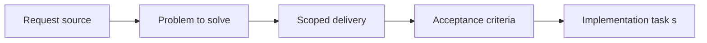

## item_024_define_single_entity_control_contract_and_input_ownership_boundaries - Define single entity control contract and input ownership boundaries
> From version: 0.1.2
> Status: Ready
> Understanding: 94%
> Confidence: 91%
> Progress: 5%
> Complexity: Medium
> Theme: Gameplay
> Reminder: Update status/understanding/confidence/progress and linked task references when you edit this doc.

# Problem
- The first playable loop needs one clear control contract for the player-controlled entity.
- This slice separates player input ownership from camera and system behavior so the runtime does not mix gestures ambiguously.

# Scope
- In: Controlled-entity input contract, ownership boundaries, and player-vs-runtime interaction rules.
- Out: Concrete mobile stick tuning, desktop fallback mapping details, or selection UI.

# Acceptance criteria
- AC1: The request defines a player interaction scope dedicated to world and entity interactions rather than leaving input behavior implicit across rendering requests.
- AC2: The request defines the first interaction verbs relevant to the project, including at least selecting, inspecting, commanding, and camera-related interactions where ownership matters.
- AC3: The request treats direct control of a single entity as the primary first interaction layer, while selection and inspection stay secondary and debug-friendly in the first loop.
- AC4: The request remains compatible with a first mobile-first direct-control slice in which a single entity is steered through the world using a touch drag input similar to a virtual joypad.
- AC5: The request treats the primary touch-drag gesture in the first player loop as entity steering rather than camera dragging.
- AC6: The request defines a visible virtual-stick baseline with a small dead zone and clamped proportional magnitude for the first mobile control scheme.
- AC7: The request keeps the first player-facing movement gesture model single-finger and avoids conflicting concurrent gesture ownership for movement.
- AC8: The request distinguishes between interactions targeting the world, interactions targeting entities, and interactions targeting UI or system overlays.
- AC9: The request covers both desktop and mobile interaction expectations at a product level, with `WASD` or arrow-key movement treated as the preferred desktop fallback and direct gestures favored for movement on mobile.
- AC10: The request stays compatible with the camera pan or zoom or rotation model defined in `req_001_render_top_down_infinite_chunked_world_map` while allowing free camera manipulation to remain debug-oriented in the first loop.
- AC11: The request remains compatible with the entity rendering and inspection expectations defined in `req_002_render_evolving_world_entities_on_the_map`.
- AC12: The request avoids prematurely locking in advanced gameplay systems that belong to later requests.

# AC Traceability
- AC1 -> Scope: The request defines a player interaction scope dedicated to world and entity interactions rather than leaving input behavior implicit across rendering requests.. Proof: TODO.
- AC2 -> Scope: The request defines the first interaction verbs relevant to the project, including at least selecting, inspecting, commanding, and camera-related interactions where ownership matters.. Proof: TODO.
- AC3 -> Scope: The request treats selection and inspection as the primary first interaction layer, with command behaviors layered on afterward.. Proof: TODO.
- AC4 -> Scope: The request remains compatible with a first mobile-first direct-control slice in which a single entity is steered through the world using a touch drag input similar to a virtual joypad.. Proof: TODO.
- AC5 -> Scope: The request treats the primary touch-drag gesture in the first player loop as entity steering rather than camera dragging.. Proof: TODO.
- AC6 -> Scope: The request defines a visible virtual-stick baseline with a small dead zone and clamped proportional magnitude for the first mobile control scheme.. Proof: TODO.
- AC7 -> Scope: The request keeps the first player-facing movement gesture model single-finger and avoids conflicting concurrent gesture ownership for movement.. Proof: TODO.
- AC8 -> Scope: The request distinguishes between interactions targeting the world, interactions targeting entities, and interactions targeting UI or system overlays.. Proof: TODO.
- AC9 -> Scope: The request covers both desktop and mobile interaction expectations at a product level, with `WASD` or arrow-key movement treated as the preferred desktop fallback and direct gestures favored for movement on mobile.. Proof: TODO.
- AC10 -> Scope: The request stays compatible with the camera pan or zoom or rotation model defined in `req_001_render_top_down_infinite_chunked_world_map` while allowing free camera manipulation to remain debug-oriented in the first loop.. Proof: TODO.
- AC11 -> Scope: The request remains compatible with the entity rendering and inspection expectations defined in `req_002_render_evolving_world_entities_on_the_map`.. Proof: TODO.
- AC12 -> Scope: The request avoids prematurely locking in advanced gameplay systems that belong to later requests.. Proof: TODO.

# Decision framing
- Product framing: Consider
- Product signals: navigation and discoverability
- Product follow-up: Review whether a product brief is needed before scope becomes harder to change.
- Architecture framing: Required
- Architecture signals: contracts and integration
- Architecture follow-up: Create or link an architecture decision before irreversible implementation work starts.

# Links
- Product brief(s): `prod_000_initial_single_entity_navigation_loop`
- Architecture decision(s): `adr_007_isolate_runtime_input_from_browser_page_controls`
- Request: `req_006_define_player_interactions_for_world_and_entities`
- Primary task(s): (none yet)

# Priority
- Impact: High
- Urgency: High

# Notes
- Derived from request `req_006_define_player_interactions_for_world_and_entities`.
- Source file: `logics/request/req_006_define_player_interactions_for_world_and_entities.md`.
- Request context seeded into this backlog item from `logics/request/req_006_define_player_interactions_for_world_and_entities.md`.
