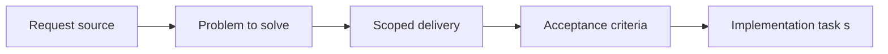

## item_028_define_fixed_timestep_simulation_loop_contract - Define fixed timestep simulation loop contract
> From version: 0.1.1
> Status: Ready
> Understanding: 93%
> Confidence: 90%
> Progress: 0%
> Complexity: Medium
> Theme: Gameplay
> Reminder: Update status/understanding/confidence/progress and linked task references when you edit this doc.

# Problem
- World and entity updates need an authoritative timing model that is independent from frame rate.
- This slice fixes the fixed-timestep contract so later simulation and movement work stays deterministic.

# Scope
- In: Authoritative update cadence, fixed-step rules, and baseline simulation contract.
- Out: Render interpolation details or debug controls beyond what proves the contract.

# Acceptance criteria
- AC1: The request defines a dedicated simulation-loop scope rather than leaving update timing implicit inside rendering concerns.
- AC2: The request defines the relationship between simulation updates and rendering frames.
- AC3: The request treats a strict fixed-timestep simulation loop as the intended baseline for logic updates.
- AC4: The request defines a deterministic or reproducible update expectation suitable for debugging and automated testing.
- AC5: The request covers pause, simulation stepping, and speed-adjustment expectations where they affect the update model.
- AC6: The request remains compatible with the world and entity requests already written.
- AC7: The request does not prematurely assume multiplayer or backend-driven synchronization.

# AC Traceability
- AC1 -> Scope: The request defines a dedicated simulation-loop scope rather than leaving update timing implicit inside rendering concerns.. Proof: TODO.
- AC2 -> Scope: The request defines the relationship between simulation updates and rendering frames.. Proof: TODO.
- AC3 -> Scope: The request treats a strict fixed-timestep simulation loop as the intended baseline for logic updates.. Proof: TODO.
- AC4 -> Scope: The request defines a deterministic or reproducible update expectation suitable for debugging and automated testing.. Proof: TODO.
- AC5 -> Scope: The request covers pause, simulation stepping, and speed-adjustment expectations where they affect the update model.. Proof: TODO.
- AC6 -> Scope: The request remains compatible with the world and entity requests already written.. Proof: TODO.
- AC7 -> Scope: The request does not prematurely assume multiplayer or backend-driven synchronization.. Proof: TODO.

# Decision framing
- Product framing: Not needed
- Product signals: (none detected)
- Product follow-up: No product brief follow-up is expected based on current signals.
- Architecture framing: Required
- Architecture signals: contracts and integration
- Architecture follow-up: Create or link an architecture decision before irreversible implementation work starts.

# Links
- Product brief(s): (none yet)
- Architecture decision(s): `adr_004_run_simulation_on_a_fixed_timestep`
- Request: `req_007_define_simulation_loop_and_deterministic_update_model`
- Primary task(s): (none yet)

# Priority
- Impact: High
- Urgency: High

# Notes
- Derived from request `req_007_define_simulation_loop_and_deterministic_update_model`.
- Source file: `logics/request/req_007_define_simulation_loop_and_deterministic_update_model.md`.
- Request context seeded into this backlog item from `logics/request/req_007_define_simulation_loop_and_deterministic_update_model.md`.
