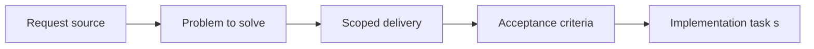

## item_030_define_pause_step_and_simulation_speed_debug_controls - Define pause step and simulation speed debug controls
> From version: 0.1.1
> Status: Done
> Understanding: 93%
> Confidence: 92%
> Progress: 100%
> Complexity: Medium
> Theme: Gameplay
> Reminder: Update status/understanding/confidence/progress and linked task references when you edit this doc.

# Problem
- A deterministic simulation loop needs basic debug controls to be usable in practice.
- This slice defines pause, single-step, and speed controls so simulation behavior can be inspected deliberately.

# Scope
- In: Pause, step, and simulation-speed control expectations for debug use.
- Out: Full debug overlay implementation or profiling metrics.

# Acceptance criteria
- AC1: The request defines a dedicated simulation-loop scope rather than leaving update timing implicit inside rendering concerns.
- AC2: The request defines the relationship between simulation updates and rendering frames.
- AC3: The request treats a strict fixed-timestep simulation loop as the intended baseline for logic updates.
- AC4: The request defines a deterministic or reproducible update expectation suitable for debugging and automated testing.
- AC5: The request covers pause, simulation stepping, and speed-adjustment expectations where they affect the update model.
- AC6: The request remains compatible with the world and entity requests already written.
- AC7: The request does not prematurely assume multiplayer or backend-driven synchronization.

# AC Traceability
- AC1 -> Scope: Debug controls are anchored in the simulation loop contract. Proof: `src/game/entities/hooks/useEntitySimulation.ts`.
- AC2 -> Scope: Controls change simulation cadence without taking over render cadence. Proof: `src/game/entities/hooks/useEntitySimulation.ts`, `src/game/debug/ShellDiagnosticsPanel.tsx`.
- AC3 -> Scope: The fixed-step baseline remains intact under pause and speed changes. Proof: `src/game/entities/model/entitySimulation.ts`, `src/game/entities/hooks/useEntitySimulation.ts`.
- AC4 -> Scope: Single-step behavior is deterministic and inspectable. Proof: `src/game/entities/hooks/useEntitySimulation.ts`, browser verification captured in `logics/tasks/task_018_orchestrate_simulation_cadence_debug_controls_and_performance_metrics.md`.
- AC5 -> Scope: Pause, step, and speed-adjustment controls are present for debug use. Proof: `src/game/debug/ShellDiagnosticsPanel.tsx`, `src/game/entities/hooks/useEntitySimulation.ts`.
- AC6 -> Scope: Controls remain compatible with the existing world and entity runtime. Proof: `src/app/AppShell.tsx`.
- AC7 -> Scope: The slice stays local to the frontend runtime. Proof: `src/game/entities/hooks/useEntitySimulation.ts`.

# Decision framing
- Product framing: Not needed
- Product signals: (none detected)
- Product follow-up: No product brief follow-up is expected based on current signals.
- Architecture framing: Consider
- Architecture signals: contracts and integration
- Architecture follow-up: Review whether an architecture decision is needed before implementation becomes harder to reverse.

# Links
- Product brief(s): (none yet)
- Architecture decision(s): `adr_004_run_simulation_on_a_fixed_timestep`
- Request: `req_007_define_simulation_loop_and_deterministic_update_model`
- Primary task(s): `task_018_orchestrate_simulation_cadence_debug_controls_and_performance_metrics`

# Priority
- Impact: Medium
- Urgency: Medium

# Notes
- Derived from request `req_007_define_simulation_loop_and_deterministic_update_model`.
- Source file: `logics/request/req_007_define_simulation_loop_and_deterministic_update_model.md`.
- Request context seeded into this backlog item from `logics/request/req_007_define_simulation_loop_and_deterministic_update_model.md`.
- Completed in `task_018_orchestrate_simulation_cadence_debug_controls_and_performance_metrics`.
