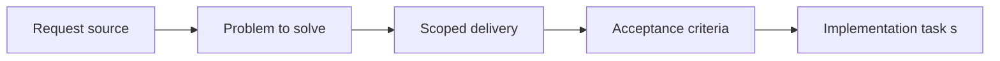

## item_038_define_browser_and_pwa_storage_operational_constraints - Define browser and PWA storage operational constraints
> From version: 0.1.1
> Status: Done
> Understanding: 93%
> Confidence: 92%
> Progress: 100%
> Complexity: Medium
> Theme: Data
> Reminder: Update status/understanding/confidence/progress and linked task references when you edit this doc.

# Problem
- Local persistence must respect browser and PWA storage realities rather than assume durable unlimited storage.
- This slice defines the operational constraints that the save strategy must live within.

# Scope
- In: Browser storage constraints, PWA considerations, and operational caveats for local saves.
- Out: Save schema details or migration logic.

# Acceptance criteria
- AC1: The request defines a dedicated local persistence scope suitable for a static frontend application.
- AC2: The request identifies the first categories of data that may need persistence and distinguishes them from transient runtime state.
- AC3: The request treats preferences, world seed, and camera state as the intended first persistence scope before richer world or entity state.
- AC4: The request remains compatible with deterministic world or seed-driven behavior already anticipated elsewhere.
- AC5: The request addresses versioning or evolution concerns for saved local data at an appropriate level, with explicit save-version handling expected from the start.
- AC6: The request remains frontend-only and does not assume accounts, backend storage, or cloud sync.
- AC7: The request stays compatible with the PWA and static-hosting direction.

# AC Traceability
- AC1 -> Scope: Storage constraints are explicit in the local persistence contract. Proof: `src/shared/lib/runtimeSessionStorage.ts`, `README.md`.
- AC2 -> Scope: The stored categories remain narrow and distinguishable from transient state. Proof: `README.md`.
- AC3 -> Scope: Browser storage is limited to preferences, seed, and camera state. Proof: `src/shared/lib/runtimeSessionStorage.ts`, `src/shared/lib/shellPreferencesStorage.ts`.
- AC4 -> Scope: The storage model stays compatible with deterministic seed-driven world reconstruction. Proof: `src/shared/lib/runtimeSessionStorage.ts`, `src/game/world/model/worldGeneration.ts`.
- AC5 -> Scope: Versioning and invalidation are explicit. Proof: `src/shared/lib/runtimeSessionStorage.ts`, `src/shared/lib/runtimeSessionStorage.test.ts`.
- AC6 -> Scope: No backend or cloud sync assumptions are made. Proof: `src/shared/lib/runtimeSessionStorage.ts`, `README.md`.
- AC7 -> Scope: The constraints remain compatible with the static PWA posture. Proof: `README.md`.

# Decision framing
- Product framing: Consider
- Product signals: experience scope
- Product follow-up: Review whether a product brief is needed before scope becomes harder to change.
- Architecture framing: Required
- Architecture signals: data model and persistence, state and sync, delivery and operations
- Architecture follow-up: Create or link an architecture decision before irreversible implementation work starts.

# Links
- Product brief(s): (none yet)
- Architecture decision(s): `adr_009_limit_persistence_to_local_versioned_frontend_storage`
- Request: `req_009_define_local_persistence_and_save_strategy`
- Primary task(s): `task_020_orchestrate_persistence_and_reconstruction_boundaries`

# Priority
- Impact: Medium
- Urgency: Low

# Notes
- Derived from request `req_009_define_local_persistence_and_save_strategy`.
- Source file: `logics/request/req_009_define_local_persistence_and_save_strategy.md`.
- Request context seeded into this backlog item from `logics/request/req_009_define_local_persistence_and_save_strategy.md`.
- Completed in `task_020_orchestrate_persistence_and_reconstruction_boundaries`.
