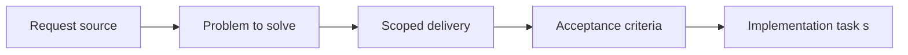

## item_040_define_official_debug_scenario_data_model - Define official debug scenario data model
> From version: 0.1.2
> Status: Done
> Understanding: 94%
> Confidence: 91%
> Progress: 100%
> Complexity: Medium
> Theme: Data
> Reminder: Update status/understanding/confidence/progress and linked task references when you edit this doc.

# Problem
- Debug scenarios need to be official shared fixtures rather than throwaway local snippets.
- This slice defines how reproducible scenarios are represented so product, testing, and runtime can share them, starting from one canonical scenario rather than many weakly maintained variants.

# Scope
- In: Scenario data structure, ownership, and reuse expectations across runtime and tests.
- Out: Full scenario editor or content pipeline tooling.

# Acceptance criteria
- AC1: The request defines a dedicated data and configuration scope rather than leaving content modeling implicit in code.
- AC2: The request distinguishes between static game data, runtime configuration, debug scenario data, and executable logic.
- AC3: The request treats typed TypeScript-backed configuration as the intended initial baseline, while leaving room for additional data-file formats later.
- AC4: The request reserves an explicit place for reproducible debug-scenario data, with one canonical official scenario as the first baseline.
- AC5: The request remains compatible with the static frontend architecture and deterministic world assumptions.
- AC6: The request addresses typed or validated data expectations at an appropriate level.
- AC7: The request stays compatible with future asset, map, and entity systems.
- AC8: The request does not require a full editor or external content-management platform.

# AC Traceability
- AC1 -> Scope: Debug-scenario authoring now lives in a dedicated data module. Proof: `src/game/debug/data/officialDebugScenario.ts`.
- AC2 -> Scope: Scenario data is distinct from runtime config and executable logic. Proof: `src/shared/config/dataAuthoringContract.ts`, `src/game/debug/data/officialDebugScenario.ts`.
- AC3 -> Scope: The official scenario is authored in typed TypeScript. Proof: `src/game/debug/data/officialDebugScenario.ts`.
- AC4 -> Scope: One canonical official scenario is defined and shared. Proof: `src/game/debug/data/officialDebugScenario.ts`, `src/game/debug/data/officialDebugScenario.test.ts`.
- AC5 -> Scope: The scenario stays compatible with deterministic world assumptions. Proof: `src/game/debug/data/officialDebugScenario.ts`, `src/shared/lib/runtimeSessionStorage.ts`.
- AC6 -> Scope: Validation expectations are explicit. Proof: `src/game/debug/data/officialDebugScenario.ts`, `src/game/debug/data/officialDebugScenario.test.ts`.
- AC7 -> Scope: The scenario references entity and terrain systems through typed ids. Proof: `src/game/entities/data/entityData.ts`, `src/game/world/data/worldData.ts`, `src/assets/assetCatalog.ts`.
- AC8 -> Scope: The model does not require scenario tooling outside the repo. Proof: `src/game/debug/data/officialDebugScenario.ts`.

# Decision framing
- Product framing: Consider
- Product signals: experience scope
- Product follow-up: Review whether a product brief is needed before scope becomes harder to change.
- Architecture framing: Required
- Architecture signals: data model and persistence, contracts and integration, delivery and operations
- Architecture follow-up: Create or link an architecture decision before irreversible implementation work starts.

# Links
- Product brief(s): `prod_000_initial_single_entity_navigation_loop`
- Architecture decision(s): `adr_011_use_typed_typescript_as_the_initial_data_and_config_authoring_model`
- Request: `req_010_define_game_data_and_configuration_model`
- Primary task(s): `task_021_orchestrate_typed_data_configuration_and_scenario_authoring`

# Priority
- Impact: High
- Urgency: Medium

# Notes
- Derived from request `req_010_define_game_data_and_configuration_model`.
- Source file: `logics/request/req_010_define_game_data_and_configuration_model.md`.
- Request context seeded into this backlog item from `logics/request/req_010_define_game_data_and_configuration_model.md`.
- Completed in `task_021_orchestrate_typed_data_configuration_and_scenario_authoring`.
