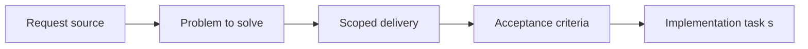

## item_042_define_data_reference_contracts_across_world_entities_and_assets - Define data reference contracts across world entities and assets
> From version: 0.1.1
> Status: Ready
> Understanding: 93%
> Confidence: 90%
> Progress: 0%
> Complexity: Medium
> Theme: Data
> Reminder: Update status/understanding/confidence/progress and linked task references when you edit this doc.

# Problem
- World, entity, and asset systems need stable reference contracts before they can compose cleanly.
- This slice defines how data points at assets and domain records without creating implicit coupling.

# Scope
- In: Reference contracts between world data, entity data, and asset identifiers.
- Out: Runtime loaders, rendering logic, or scenario authoring UI.

# Acceptance criteria
- AC1: The request defines a dedicated data and configuration scope rather than leaving content modeling implicit in code.
- AC2: The request distinguishes between static game data, runtime configuration, debug scenario data, and executable logic.
- AC3: The request treats typed TypeScript-backed configuration as the intended initial baseline, while leaving room for additional data-file formats later.
- AC4: The request reserves an explicit place for reproducible debug-scenario data.
- AC5: The request remains compatible with the static frontend architecture and deterministic world assumptions.
- AC6: The request addresses typed or validated data expectations at an appropriate level.
- AC7: The request stays compatible with future asset, map, and entity systems.
- AC8: The request does not require a full editor or external content-management platform.

# AC Traceability
- AC1 -> Scope: The request defines a dedicated data and configuration scope rather than leaving content modeling implicit in code.. Proof: TODO.
- AC2 -> Scope: The request distinguishes between static game data, runtime configuration, debug scenario data, and executable logic.. Proof: TODO.
- AC3 -> Scope: The request treats typed TypeScript-backed configuration as the intended initial baseline, while leaving room for additional data-file formats later.. Proof: TODO.
- AC4 -> Scope: The request reserves an explicit place for reproducible debug-scenario data.. Proof: TODO.
- AC5 -> Scope: The request remains compatible with the static frontend architecture and deterministic world assumptions.. Proof: TODO.
- AC6 -> Scope: The request addresses typed or validated data expectations at an appropriate level.. Proof: TODO.
- AC7 -> Scope: The request stays compatible with future asset, map, and entity systems.. Proof: TODO.
- AC8 -> Scope: The request does not require a full editor or external content-management platform.. Proof: TODO.

# Decision framing
- Product framing: Consider
- Product signals: experience scope
- Product follow-up: Review whether a product brief is needed before scope becomes harder to change.
- Architecture framing: Required
- Architecture signals: data model and persistence, contracts and integration, delivery and operations
- Architecture follow-up: Create or link an architecture decision before irreversible implementation work starts.

# Links
- Product brief(s): (none yet)
- Architecture decision(s): `adr_008_define_asset_logical_sizing_and_runtime_packaging_rules`, `adr_011_use_typed_typescript_as_the_initial_data_and_config_authoring_model`
- Request: `req_010_define_game_data_and_configuration_model`
- Primary task(s): (none yet)

# Priority
- Impact: Medium
- Urgency: Medium

# Notes
- Derived from request `req_010_define_game_data_and_configuration_model`.
- Source file: `logics/request/req_010_define_game_data_and_configuration_model.md`.
- Request context seeded into this backlog item from `logics/request/req_010_define_game_data_and_configuration_model.md`.
