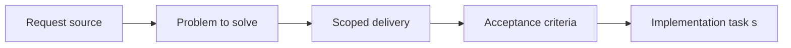

## item_044_define_minimal_player_facing_runtime_feedback_and_onboarding_surfaces - Define minimal player facing runtime feedback and onboarding surfaces
> From version: 0.1.1
> Status: Ready
> Understanding: 93%
> Confidence: 90%
> Progress: 0%
> Complexity: Medium
> Theme: UX
> Reminder: Update status/understanding/confidence/progress and linked task references when you edit this doc.

# Problem
- The first player loop needs just enough on-screen feedback to be understandable without clutter.
- This slice defines the minimal onboarding and runtime feedback surfaces that support the first-minute experience.

# Scope
- In: Short onboarding hinting, minimal player-facing runtime feedback, and contextual visibility rules.
- Out: Permanent HUD bars, debug overlays, or full menu systems.

# Acceptance criteria
- AC1: The request defines a dedicated UI or HUD or overlay scope rather than leaving overlay behavior implicit inside rendering requests.
- AC2: The request distinguishes between world-space visuals and screen-space UI or system overlays.
- AC3: The request treats fullscreen entry prompts, system prompts, and debug or inspection panels as DOM-owned by default.
- AC4: The request remains compatible with the fullscreen shell and thin DOM overlay direction already established.
- AC5: The request addresses mobile and desktop overlay behavior at a product level.
- AC6: The request favors contextual overlays first and keeps permanent HUD expectations intentionally light.
- AC7: The request stays compatible with debug diagnostics, selection or inspection surfaces, and future gameplay HUD needs.
- AC8: The request does not prematurely lock final art direction or every future menu flow.

# AC Traceability
- AC1 -> Scope: The request defines a dedicated UI or HUD or overlay scope rather than leaving overlay behavior implicit inside rendering requests.. Proof: TODO.
- AC2 -> Scope: The request distinguishes between world-space visuals and screen-space UI or system overlays.. Proof: TODO.
- AC3 -> Scope: The request treats fullscreen entry prompts, system prompts, and debug or inspection panels as DOM-owned by default.. Proof: TODO.
- AC4 -> Scope: The request remains compatible with the fullscreen shell and thin DOM overlay direction already established.. Proof: TODO.
- AC5 -> Scope: The request addresses mobile and desktop overlay behavior at a product level.. Proof: TODO.
- AC6 -> Scope: The request favors contextual overlays first and keeps permanent HUD expectations intentionally light.. Proof: TODO.
- AC7 -> Scope: The request stays compatible with debug diagnostics, selection or inspection surfaces, and future gameplay HUD needs.. Proof: TODO.
- AC8 -> Scope: The request does not prematurely lock final art direction or every future menu flow.. Proof: TODO.

# Decision framing
- Product framing: Required
- Product signals: conversion journey, navigation and discoverability
- Product follow-up: Create or link a product brief before implementation moves deeper into delivery.
- Architecture framing: Not needed
- Architecture signals: (none detected)
- Architecture follow-up: No architecture decision follow-up is expected based on current signals.

# Links
- Product brief(s): `prod_001_minimal_overlay_and_feedback_for_early_runtime`, `prod_000_initial_single_entity_navigation_loop`
- Architecture decision(s): `adr_002_separate_react_shell_from_pixi_runtime_ownership`
- Request: `req_011_define_ui_hud_and_overlay_system`
- Primary task(s): (none yet)

# Priority
- Impact: High
- Urgency: High

# Notes
- Derived from request `req_011_define_ui_hud_and_overlay_system`.
- Source file: `logics/request/req_011_define_ui_hud_and_overlay_system.md`.
- Request context seeded into this backlog item from `logics/request/req_011_define_ui_hud_and_overlay_system.md`.
