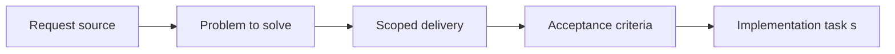

## item_046_define_debug_overlay_separation_from_player_facing_hud - Define debug overlay separation from player facing HUD
> From version: 0.1.1
> Status: Done
> Understanding: 93%
> Confidence: 91%
> Progress: 100%
> Complexity: Medium
> Theme: UX
> Reminder: Update status/understanding/confidence/progress and linked task references when you edit this doc.

# Problem
- Debug information must remain available without contaminating the default player UI.
- This slice defines the separation between debug overlays and player-facing HUD behavior.

# Scope
- In: Debug-vs-player overlay boundaries, visibility modes, and separation rules.
- Out: Detailed diagnostics metric set or profiling process.

# Acceptance criteria
- AC1: The request defines a dedicated UI or HUD or overlay scope rather than leaving overlay behavior implicit inside rendering requests.
- AC2: The request distinguishes between world-space visuals and screen-space UI or system overlays.
- AC3: The request treats fullscreen entry prompts, system prompts, and debug or inspection panels as DOM-owned by default.
- AC4: The request remains compatible with the fullscreen shell and thin DOM overlay direction already established.
- AC5: The request addresses mobile and desktop overlay behavior at a product level.
- AC6: The request favors contextual overlays first and keeps permanent HUD expectations intentionally light.
- AC7: The request stays compatible with debug diagnostics, selection or inspection surfaces, and future gameplay HUD needs.
- AC8: The request does not prematurely lock final art direction or every future menu flow.

# AC Traceability
- AC1 -> Scope: HUD and diagnostics are implemented as separate surfaces. Proof: `src/app/AppShell.tsx`.
- AC2 -> Scope: Both remain screen-space and outside the world renderer. Proof: `src/app/AppShell.tsx`, `src/game/render/RuntimeSurface.tsx`.
- AC3 -> Scope: Debug panels remain DOM-owned instead of leaking into the world layer. Proof: `src/game/debug/ShellDiagnosticsPanel.tsx`, `src/app/AppShell.tsx`.
- AC4 -> Scope: Separation remains compatible with the fullscreen shell. Proof: `src/app/styles/app.css`.
- AC5 -> Scope: Separation is preserved in desktop and mobile overlay layouts. Proof: `src/app/styles/app.css`, `src/app/AppShell.tsx`.
- AC6 -> Scope: Player-facing HUD remains lighter than diagnostics. Proof: `src/app/components/PlayerHudCard.tsx`, `src/game/debug/ShellDiagnosticsPanel.tsx`.
- AC7 -> Scope: Debug, selection, and inspection coexist without sharing one panel. Proof: `src/app/components/EntityInspectionPanel.tsx`, `src/game/debug/ShellDiagnosticsPanel.tsx`, `src/app/AppShell.tsx`.
- AC8 -> Scope: Separation is structural and not tied to final art/menu choices. Proof: `src/app/AppShell.tsx`.

# Decision framing
- Product framing: Consider
- Product signals: navigation and discoverability
- Product follow-up: Review whether a product brief is needed before scope becomes harder to change.
- Architecture framing: Not needed
- Architecture signals: (none detected)
- Architecture follow-up: No architecture decision follow-up is expected based on current signals.

# Links
- Product brief(s): `prod_001_minimal_overlay_and_feedback_for_early_runtime`
- Architecture decision(s): `adr_006_standardize_debug_first_runtime_instrumentation`
- Request: `req_011_define_ui_hud_and_overlay_system`
- Primary task(s): `task_017_orchestrate_player_facing_interaction_feedback_and_overlay_surfaces`

# Priority
- Impact: Medium
- Urgency: Medium

# Notes
- Derived from request `req_011_define_ui_hud_and_overlay_system`.
- Source file: `logics/request/req_011_define_ui_hud_and_overlay_system.md`.
- Request context seeded into this backlog item from `logics/request/req_011_define_ui_hud_and_overlay_system.md`.
- Completed in `task_017_orchestrate_player_facing_interaction_feedback_and_overlay_surfaces`.
