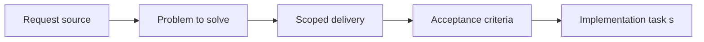

## item_050_define_unit_and_integration_testing_priorities_for_transforms_world_and_simulation - Define unit and integration testing priorities for transforms world and simulation
> From version: 0.1.1
> Status: Done
> Understanding: 93%
> Confidence: 90%
> Progress: 100%
> Complexity: Medium
> Theme: Quality
> Reminder: Update status/understanding/confidence/progress and linked task references when you edit this doc.

# Problem
- The test strategy needs a clear first target set instead of broad generic coverage goals.
- This slice prioritizes transform, world, and simulation checks so the riskiest math-heavy systems are automated first.

# Scope
- In: Unit and integration priorities for coordinate transforms, chunk visibility, and simulation behavior.
- Out: Browser smoke workflow or CI gating details.

# Acceptance criteria
- AC1: The request defines a dedicated testing strategy scope for the frontend project.
- AC2: The request distinguishes between at least some of the relevant test levels, such as unit, integration, browser, or scenario validation.
- AC3: The request treats camera or transform invariants, chunk-visibility logic, and deterministic simulation behavior as the first high-priority automated targets.
- AC4: The request includes lightweight browser smoke validation as an early part of the strategy.
- AC5: The request treats world or camera transform math as a higher early automation priority than the first player-loop browser scenario.
- AC6: Once the first controllable-entity loop exists, the strategy includes a browser-level check that validates directional input leading to visible entity movement.
- AC7: The request remains compatible with deterministic world or simulation behavior already anticipated in other requests.
- AC8: The request stays compatible with the future GitHub Actions CI pipeline.
- AC9: The request addresses testing concerns for rendering or coordinate logic at an appropriate level rather than treating the project as ordinary form-based UI only.
- AC10: The request does not require a disproportionate testing platform relative to the current project stage.

# AC Traceability
- AC1 -> Scope: The repo now exposes a dedicated frontend testing strategy with explicit tiers. Proof: `README.md`, `package.json`.
- AC2 -> Scope: Unit, integration, fixture, and browser-smoke levels are distinguished. Proof: `package.json`, `src/test/fixtures/runtimeFixtures.test.ts`, `scripts/testing/runBrowserSmoke.mjs`.
- AC3 -> Scope: Transform math, deterministic world logic, and simulation remain the first automated targets. Proof: `src/game/camera/model/cameraMath.test.ts`, `src/game/world/model/worldViewMath.test.ts`, `src/game/world/model/worldGeneration.test.ts`, `src/game/entities/model/entitySimulation.test.ts`.
- AC4 -> Scope: A lightweight browser smoke tier exists early. Proof: `scripts/testing/runBrowserSmoke.mjs`, `package.json`.
- AC5 -> Scope: Math-heavy tests remain the fast blocking tier ahead of browser smoke. Proof: `package.json`, `.github/workflows/ci.yml`.
- AC6 -> Scope: Browser smoke validates directional input leading to visible entity movement. Proof: `scripts/testing/runBrowserSmoke.mjs`.
- AC7 -> Scope: Tests stay aligned with deterministic world and scenario assumptions. Proof: `src/test/fixtures/runtimeFixtures.ts`, `src/game/debug/data/officialDebugScenario.ts`.
- AC8 -> Scope: The strategy is wired into GitHub Actions. Proof: `.github/workflows/ci.yml`.
- AC9 -> Scope: Rendering/coordinate logic is treated as a first-class test concern. Proof: `src/game/world/model/worldViewMath.test.ts`, `src/game/world/model/worldContract.test.ts`.
- AC10 -> Scope: The browser tier stays intentionally narrow. Proof: `scripts/testing/runBrowserSmoke.mjs`, `README.md`.

# Decision framing
- Product framing: Not needed
- Product signals: (none detected)
- Product follow-up: No product brief follow-up is expected based on current signals.
- Architecture framing: Required
- Architecture signals: data model and persistence, contracts and integration
- Architecture follow-up: Create or link an architecture decision before irreversible implementation work starts.

# Links
- Product brief(s): (none yet)
- Architecture decision(s): `adr_003_define_coordinate_spaces_and_camera_contract`, `adr_004_run_simulation_on_a_fixed_timestep`
- Request: `req_013_define_frontend_testing_strategy_for_rendering_simulation_and_world_logic`
- Primary task(s): `task_022_orchestrate_testing_browser_smoke_and_ci_execution_tiers`

# Priority
- Impact: High
- Urgency: High

# Notes
- Derived from request `req_013_define_frontend_testing_strategy_for_rendering_simulation_and_world_logic`.
- Source file: `logics/request/req_013_define_frontend_testing_strategy_for_rendering_simulation_and_world_logic.md`.
- Request context seeded into this backlog item from `logics/request/req_013_define_frontend_testing_strategy_for_rendering_simulation_and_world_logic.md`.
- Completed in `task_022_orchestrate_testing_browser_smoke_and_ci_execution_tiers`.
