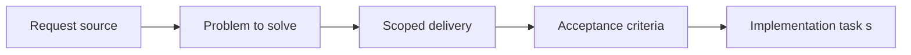

## item_051_define_browser_smoke_strategy_for_runtime_and_first_player_loop - Define browser smoke strategy for runtime and first player loop
> From version: 0.1.2
> Status: Done
> Understanding: 94%
> Confidence: 91%
> Progress: 100%
> Complexity: Medium
> Theme: Quality
> Reminder: Update status/understanding/confidence/progress and linked task references when you edit this doc.

# Problem
- The frontend needs a lightweight browser-level safety net before deep end-to-end coverage exists.
- This slice defines smoke checks for the runtime shell first, then the first player loop once transform math is trusted.

# Scope
- In: Browser smoke scenarios, runtime startup validation, and first-loop input-to-movement checks.
- Out: Full scenario matrix or CI tiering rules.

# Acceptance criteria
- AC1: The request defines a dedicated testing strategy scope for the frontend project.
- AC2: The request distinguishes between at least some of the relevant test levels, such as unit, integration, browser, or scenario validation.
- AC3: The request treats camera or transform invariants, chunk-visibility logic, and deterministic simulation behavior as the first high-priority automated targets.
- AC4: The request includes lightweight browser smoke validation as an early part of the strategy, starting with a desktop viewport baseline before mobile emulation expands the matrix.
- AC5: The request treats world or camera transform math as a higher early automation priority than the first player-loop browser scenario.
- AC6: Once the first controllable-entity loop exists, the strategy includes a browser-level check that validates directional input leading to visible entity movement.
- AC7: The request remains compatible with deterministic world or simulation behavior already anticipated in other requests.
- AC8: The request stays compatible with the future GitHub Actions CI pipeline.
- AC9: The request addresses testing concerns for rendering or coordinate logic at an appropriate level rather than treating the project as ordinary form-based UI only.
- AC10: The request does not require a disproportionate testing platform relative to the current project stage.

# AC Traceability
- AC1 -> Scope: Browser smoke is a dedicated repo-level testing slice. Proof: `package.json`, `scripts/testing/runBrowserSmoke.mjs`.
- AC2 -> Scope: Browser smoke is separated from unit/integration checks. Proof: `package.json`, `.github/workflows/ci.yml`.
- AC3 -> Scope: Browser smoke builds on already-covered transform and simulation invariants. Proof: `src/game/world/model/worldViewMath.test.ts`, `src/game/entities/model/entitySimulation.test.ts`.
- AC4 -> Scope: The smoke flow starts with a desktop viewport baseline. Proof: `scripts/testing/runBrowserSmoke.mjs`.
- AC5 -> Scope: Fast math and deterministic tests remain higher-priority automation tiers. Proof: `package.json`, `.github/workflows/ci.yml`.
- AC6 -> Scope: The smoke flow validates input to visible player movement. Proof: `scripts/testing/runBrowserSmoke.mjs`.
- AC7 -> Scope: The flow stays deterministic through the official scenario and seeded runtime defaults. Proof: `src/test/fixtures/runtimeFixtures.ts`, `src/game/debug/data/officialDebugScenario.ts`.
- AC8 -> Scope: The browser tier is compatible with CI. Proof: `.github/workflows/ci.yml`.
- AC9 -> Scope: The smoke asserts runtime-shell and gameplay-facing surfaces, not generic form UI. Proof: `scripts/testing/runBrowserSmoke.mjs`.
- AC10 -> Scope: The first smoke remains intentionally narrow and desktop-only. Proof: `README.md`, `scripts/testing/runBrowserSmoke.mjs`.

# Decision framing
- Product framing: Not needed
- Product signals: (none detected)
- Product follow-up: No product brief follow-up is expected based on current signals.
- Architecture framing: Required
- Architecture signals: data model and persistence, contracts and integration
- Architecture follow-up: Create or link an architecture decision before irreversible implementation work starts.

# Links
- Product brief(s): `prod_000_initial_single_entity_navigation_loop`
- Architecture decision(s): `adr_003_define_coordinate_spaces_and_camera_contract`, `adr_004_run_simulation_on_a_fixed_timestep`
- Request: `req_013_define_frontend_testing_strategy_for_rendering_simulation_and_world_logic`
- Primary task(s): `task_022_orchestrate_testing_browser_smoke_and_ci_execution_tiers`

# Priority
- Impact: High
- Urgency: Medium

# Notes
- Derived from request `req_013_define_frontend_testing_strategy_for_rendering_simulation_and_world_logic`.
- Source file: `logics/request/req_013_define_frontend_testing_strategy_for_rendering_simulation_and_world_logic.md`.
- Request context seeded into this backlog item from `logics/request/req_013_define_frontend_testing_strategy_for_rendering_simulation_and_world_logic.md`.
- Completed in `task_022_orchestrate_testing_browser_smoke_and_ci_execution_tiers`.
