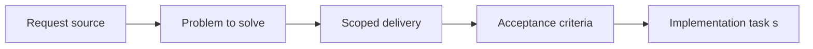

## item_052_define_deterministic_fixtures_and_scenarios_for_automated_tests - Define deterministic fixtures and scenarios for automated tests
> From version: 0.1.1
> Status: Ready
> Understanding: 93%
> Confidence: 90%
> Progress: 0%
> Complexity: Medium
> Theme: Quality
> Reminder: Update status/understanding/confidence/progress and linked task references when you edit this doc.

# Problem
- Automated tests need deterministic fixtures that match the runtime world model.
- This slice defines reusable test scenarios and fixtures so rendering, simulation, and player-loop tests stay reproducible.

# Scope
- In: Deterministic fixtures, seeded scenarios, and shared automated-test data contracts.
- Out: Test runner configuration or CI gating policy.

# Acceptance criteria
- AC1: The request defines a dedicated testing strategy scope for the frontend project.
- AC2: The request distinguishes between at least some of the relevant test levels, such as unit, integration, browser, or scenario validation.
- AC3: The request treats camera or transform invariants, chunk-visibility logic, and deterministic simulation behavior as the first high-priority automated targets.
- AC4: The request includes lightweight browser smoke validation as an early part of the strategy.
- AC5: The request treats world or camera transform math as a higher early automation priority than the first player-loop browser scenario.
- AC6: Once the first controllable-entity loop exists, the strategy includes a browser-level check that validates directional input leading to visible entity movement.
- AC7: The request remains compatible with deterministic world or simulation behavior already anticipated in other requests.
- AC8: The request stays compatible with the future GitHub Actions CI pipeline.
- AC9: The request addresses testing concerns for rendering or coordinate logic at an appropriate level rather than treating the project as ordinary form-based UI only.
- AC10: The request does not require a disproportionate testing platform relative to the current project stage.

# AC Traceability
- AC1 -> Scope: The request defines a dedicated testing strategy scope for the frontend project.. Proof: TODO.
- AC2 -> Scope: The request distinguishes between at least some of the relevant test levels, such as unit, integration, browser, or scenario validation.. Proof: TODO.
- AC3 -> Scope: The request treats camera or transform invariants, chunk-visibility logic, and deterministic simulation behavior as the first high-priority automated targets.. Proof: TODO.
- AC4 -> Scope: The request includes lightweight browser smoke validation as an early part of the strategy.. Proof: TODO.
- AC5 -> Scope: The request treats world or camera transform math as a higher early automation priority than the first player-loop browser scenario.. Proof: TODO.
- AC6 -> Scope: Once the first controllable-entity loop exists, the strategy includes a browser-level check that validates directional input leading to visible entity movement.. Proof: TODO.
- AC7 -> Scope: The request remains compatible with deterministic world or simulation behavior already anticipated in other requests.. Proof: TODO.
- AC8 -> Scope: The request stays compatible with the future GitHub Actions CI pipeline.. Proof: TODO.
- AC9 -> Scope: The request addresses testing concerns for rendering or coordinate logic at an appropriate level rather than treating the project as ordinary form-based UI only.. Proof: TODO.
- AC10 -> Scope: The request does not require a disproportionate testing platform relative to the current project stage.. Proof: TODO.

# Decision framing
- Product framing: Not needed
- Product signals: (none detected)
- Product follow-up: No product brief follow-up is expected based on current signals.
- Architecture framing: Required
- Architecture signals: data model and persistence, contracts and integration
- Architecture follow-up: Create or link an architecture decision before irreversible implementation work starts.

# Links
- Product brief(s): `prod_000_initial_single_entity_navigation_loop`
- Architecture decision(s): `adr_005_make_world_identity_deterministic_from_seed_and_coordinates`, `adr_011_use_typed_typescript_as_the_initial_data_and_config_authoring_model`
- Request: `req_013_define_frontend_testing_strategy_for_rendering_simulation_and_world_logic`
- Primary task(s): (none yet)

# Priority
- Impact: High
- Urgency: Medium

# Notes
- Derived from request `req_013_define_frontend_testing_strategy_for_rendering_simulation_and_world_logic`.
- Source file: `logics/request/req_013_define_frontend_testing_strategy_for_rendering_simulation_and_world_logic.md`.
- Request context seeded into this backlog item from `logics/request/req_013_define_frontend_testing_strategy_for_rendering_simulation_and_world_logic.md`.
