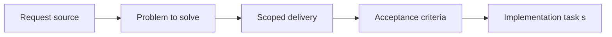

## item_053_define_ci_test_execution_tiers_and_gating_rules - Define CI test execution tiers and gating rules
> From version: 0.1.1
> Status: Done
> Understanding: 93%
> Confidence: 90%
> Progress: 100%
> Complexity: Medium
> Theme: Quality
> Reminder: Update status/understanding/confidence/progress and linked task references when you edit this doc.

# Problem
- Test coverage will grow across unit, integration, and browser layers and needs a CI gating policy.
- This slice defines how tests are tiered in CI so feedback stays useful without making the pipeline unmanageable.

# Scope
- In: CI execution tiers, blocking-vs-nonblocking rules, and test gate expectations.
- Out: Authoring the tests themselves or release workflow policy.

# Acceptance criteria
- AC1: The request defines a dedicated testing strategy scope for the frontend project.
- AC2: The request distinguishes between at least some of the relevant test levels, such as unit, integration, browser, or scenario validation.
- AC3: The request treats camera or transform invariants, chunk-visibility logic, and deterministic simulation behavior as the first high-priority automated targets.
- AC4: The request includes lightweight browser smoke validation as an early part of the strategy.
- AC5: The request treats world or camera transform math as a higher early automation priority than the first player-loop browser scenario.
- AC6: Once the first controllable-entity loop exists, the strategy includes a browser-level check that validates directional input leading to visible entity movement.
- AC7: The request remains compatible with deterministic world or simulation behavior already anticipated in other requests.
- AC8: The request stays compatible with the future GitHub Actions CI pipeline.
- AC9: The request addresses testing concerns for rendering or coordinate logic at an appropriate level rather than treating the project as ordinary form-based UI only.
- AC10: The request does not require a disproportionate testing platform relative to the current project stage.

# AC Traceability
- AC1 -> Scope: CI execution tiers are explicit instead of implicit. Proof: `package.json`, `.github/workflows/ci.yml`.
- AC2 -> Scope: Fast and slower tiers are distinguished. Proof: `package.json`, `.github/workflows/ci.yml`.
- AC3 -> Scope: Fast blocking gates keep transform/simulation tests in the first tier. Proof: `package.json`.
- AC4 -> Scope: Browser smoke is an explicit slower tier. Proof: `package.json`, `.github/workflows/ci.yml`.
- AC5 -> Scope: The first tier keeps world/camera math ahead of browser smoke. Proof: `package.json`, `.github/workflows/ci.yml`.
- AC6 -> Scope: The slower tier includes visible input-to-movement validation. Proof: `scripts/testing/runBrowserSmoke.mjs`.
- AC7 -> Scope: The tiers remain compatible with deterministic world assumptions. Proof: `src/test/fixtures/runtimeFixtures.ts`, `src/game/debug/data/officialDebugScenario.ts`.
- AC8 -> Scope: The rules are implemented directly in GitHub Actions. Proof: `.github/workflows/ci.yml`.
- AC9 -> Scope: The tiers target runtime/rendering behavior appropriately. Proof: `scripts/testing/runBrowserSmoke.mjs`.
- AC10 -> Scope: The CI posture stays proportionate by limiting browser smoke to `release` and manual runs. Proof: `.github/workflows/ci.yml`, `README.md`.

# Decision framing
- Product framing: Not needed
- Product signals: (none detected)
- Product follow-up: No product brief follow-up is expected based on current signals.
- Architecture framing: Required
- Architecture signals: data model and persistence, contracts and integration
- Architecture follow-up: Create or link an architecture decision before irreversible implementation work starts.

# Links
- Product brief(s): (none yet)
- Architecture decision(s): `adr_004_run_simulation_on_a_fixed_timestep`, `adr_006_standardize_debug_first_runtime_instrumentation`
- Request: `req_013_define_frontend_testing_strategy_for_rendering_simulation_and_world_logic`
- Primary task(s): `task_022_orchestrate_testing_browser_smoke_and_ci_execution_tiers`

# Priority
- Impact: Medium
- Urgency: Medium

# Notes
- Derived from request `req_013_define_frontend_testing_strategy_for_rendering_simulation_and_world_logic`.
- Source file: `logics/request/req_013_define_frontend_testing_strategy_for_rendering_simulation_and_world_logic.md`.
- Request context seeded into this backlog item from `logics/request/req_013_define_frontend_testing_strategy_for_rendering_simulation_and_world_logic.md`.
- Completed in `task_022_orchestrate_testing_browser_smoke_and_ci_execution_tiers`.
