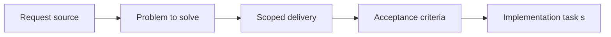

## item_056_define_future_facing_navigation_and_terrain_interaction_contract - Define future facing navigation and terrain interaction contract
> From version: 0.1.1
> Status: Ready
> Understanding: 93%
> Confidence: 90%
> Progress: 0%
> Complexity: Medium
> Theme: Gameplay
> Reminder: Update status/understanding/confidence/progress and linked task references when you edit this doc.

# Problem
- Later movement and terrain systems need an agreed contract before implementation starts branching.
- This slice defines the future-facing navigation boundary so the project can evolve without replacing its early world model.

# Scope
- In: Navigation contract, terrain-interaction expectations, and forward-compatible movement boundaries.
- Out: Full pathfinding implementation or terrain generation details.

# Acceptance criteria
- AC1: The request defines a dedicated spatial-rules scope connecting entities and world space.
- AC2: The request addresses occupancy expectations for entities in relation to tiles or world coordinates.
- AC3: The request treats world space as continuous by default, with grid or tile structure used as a helper rather than the only movement model.
- AC4: The request addresses baseline navigation or traversal rules at a product or architecture level.
- AC5: The request remains compatible with the chunked world model and entity footprint expectations already defined elsewhere.
- AC6: The request allows early overlap situations to be tolerated and diagnosed before a fuller resolution model exists.
- AC7: The request does not overreach into advanced AI, combat, or full physics systems.
- AC8: The request remains compatible with future interaction and simulation requests.

# AC Traceability
- AC1 -> Scope: The request defines a dedicated spatial-rules scope connecting entities and world space.. Proof: TODO.
- AC2 -> Scope: The request addresses occupancy expectations for entities in relation to tiles or world coordinates.. Proof: TODO.
- AC3 -> Scope: The request treats world space as continuous by default, with grid or tile structure used as a helper rather than the only movement model.. Proof: TODO.
- AC4 -> Scope: The request addresses baseline navigation or traversal rules at a product or architecture level.. Proof: TODO.
- AC5 -> Scope: The request remains compatible with the chunked world model and entity footprint expectations already defined elsewhere.. Proof: TODO.
- AC6 -> Scope: The request allows early overlap situations to be tolerated and diagnosed before a fuller resolution model exists.. Proof: TODO.
- AC7 -> Scope: The request does not overreach into advanced AI, combat, or full physics systems.. Proof: TODO.
- AC8 -> Scope: The request remains compatible with future interaction and simulation requests.. Proof: TODO.

# Decision framing
- Product framing: Required
- Product signals: navigation and discoverability
- Product follow-up: Create or link a product brief before implementation moves deeper into delivery.
- Architecture framing: Required
- Architecture signals: contracts and integration
- Architecture follow-up: Create or link an architecture decision before irreversible implementation work starts.

# Links
- Product brief(s): `prod_002_readable_world_traversal_and_presence`
- Architecture decision(s): `adr_003_define_coordinate_spaces_and_camera_contract`
- Request: `req_014_define_world_occupancy_navigation_and_interaction_rules`
- Primary task(s): (none yet)

# Priority
- Impact: Medium
- Urgency: Low

# Notes
- Derived from request `req_014_define_world_occupancy_navigation_and_interaction_rules`.
- Source file: `logics/request/req_014_define_world_occupancy_navigation_and_interaction_rules.md`.
- Request context seeded into this backlog item from `logics/request/req_014_define_world_occupancy_navigation_and_interaction_rules.md`.
