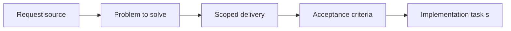

## item_058_define_release_readiness_gates_and_deployable_artifact_identification - Define release readiness gates and deployable artifact identification
> From version: 0.1.2
> Status: Ready
> Understanding: 95%
> Confidence: 92%
> Progress: 5%
> Complexity: Medium
> Theme: Delivery
> Reminder: Update status/understanding/confidence/progress and linked task references when you edit this doc.

# Problem
- Delivery needs a clear definition of when a build is considered release-ready.
- This slice defines readiness gates, deployable artifact identity, and release-branch entry rules so releases are not treated informally.

# Scope
- In: Release-readiness criteria, deployable artifact identity, release entry rules, and promotion expectations onto the `release` branch.
- Out: Versioning details, smoke-check mechanics, or Render platform config.

# Acceptance criteria
- AC1: The request defines a release-workflow scope distinct from raw deployment configuration.
- AC2: The request remains compatible with the static Render-hosting model and the future GitHub Actions CI pipeline.
- AC3: The request treats lightweight semantic versioning and a simple changelog discipline as the intended default release-identification model.
- AC4: The request addresses at least release readiness, version identification, deployable-branch expectations, and operational validation expectations, including a minimal post-deployment smoke check.
- AC5: The request treats the `release` branch as the branch that carries deployable release-ready states rather than using `main` as the production deployment branch.
- AC6: If preview-style environments are introduced later, the request treats them first as technical validation surfaces rather than as separate product release channels.
- AC7: The request addresses rollback or recovery thinking appropriate to a static-site deployment.
- AC8: The request does not assume a backend service topology or an enterprise-grade release-management stack.
- AC9: The request complements rather than duplicates the Render Blueprint request.

# AC Traceability
- AC1 -> Scope: The request defines a release-workflow scope distinct from raw deployment configuration.. Proof: TODO.
- AC2 -> Scope: The request remains compatible with the static Render-hosting model and the future GitHub Actions CI pipeline.. Proof: TODO.
- AC3 -> Scope: The request treats lightweight semantic versioning and a simple changelog discipline as the intended default release-identification model.. Proof: TODO.
- AC4 -> Scope: The request addresses at least release readiness, version identification, deployable-branch expectations, and operational validation expectations, including a minimal post-deployment smoke check.. Proof: TODO.
- AC5 -> Scope: The request treats the `release` branch as the branch that carries deployable release-ready states rather than using `main` as the production deployment branch.. Proof: TODO.
- AC6 -> Scope: If preview-style environments are introduced later, the request treats them first as technical validation surfaces rather than as separate product release channels.. Proof: TODO.
- AC7 -> Scope: The request addresses rollback or recovery thinking appropriate to a static-site deployment.. Proof: TODO.
- AC8 -> Scope: The request does not assume a backend service topology or an enterprise-grade release-management stack.. Proof: TODO.
- AC9 -> Scope: The request complements rather than duplicates the Render Blueprint request.. Proof: TODO.

# Decision framing
- Product framing: Not needed
- Product signals: (none detected)
- Product follow-up: No product brief follow-up is expected based on current signals.
- Architecture framing: Consider
- Architecture signals: delivery and operations
- Architecture follow-up: Review whether an architecture decision is needed before implementation becomes harder to reverse.

# Links
- Product brief(s): (none yet)
- Architecture decision(s): `adr_013_use_a_dedicated_release_branch_for_deployable_static_releases`
- Request: `req_015_define_release_workflow_and_deployment_operations`
- Primary task(s): (none yet)

# Priority
- Impact: High
- Urgency: Medium

# Notes
- Derived from request `req_015_define_release_workflow_and_deployment_operations`.
- Source file: `logics/request/req_015_define_release_workflow_and_deployment_operations.md`.
- Request context seeded into this backlog item from `logics/request/req_015_define_release_workflow_and_deployment_operations.md`.
