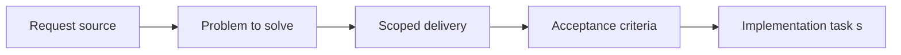

## item_059_define_semantic_versioning_and_changelog_operating_model - Define semantic versioning and changelog operating model
> From version: 0.1.2
> Status: Ready
> Understanding: 95%
> Confidence: 92%
> Progress: 10%
> Complexity: Medium
> Theme: Delivery
> Reminder: Update status/understanding/confidence/progress and linked task references when you edit this doc.

# Problem
- Release communication needs a lightweight but explicit operating model.
- This slice defines how versions and changelog entries are maintained so delivered states remain understandable and no release ships without curated notes.

# Scope
- In: Versioning rules, mandatory curated changelog expectations, release-labeling practice, and version-to-changelog matching rules.
- Out: Smoke checks, rollback mechanics, or Render deployment config.

# Acceptance criteria
- AC1: The request defines a release-workflow scope distinct from raw deployment configuration.
- AC2: The request remains compatible with the static Render-hosting model and the future GitHub Actions CI pipeline.
- AC3: The request treats lightweight semantic versioning and a curated changelog discipline as the intended default release-identification model.
- AC4: The request defines `package.json` as the source of truth for the application version and requires a matching changelog file for each released version.
- AC5: The request treats a missing or stale changelog as a release blocker rather than an optional documentation gap.
- AC6: The request defines a per-version changelog naming convention compatible with the user's existing repositories, such as `changelogs/CHANGELOGS_X_Y_Z.md`.
- AC7: The request treats Git tags and GitHub releases as consumers of curated version notes rather than relying only on auto-generated notes.
- AC8: The request remains compatible with the static Render-hosting model and the future GitHub Actions CI pipeline.
- AC9: If preview-style environments are introduced later, the request treats them first as technical validation surfaces rather than as separate product release channels.
- AC10: The request addresses rollback or recovery thinking appropriate to a static-site deployment.
- AC11: The request does not assume a backend service topology or an enterprise-grade release-management stack.
- AC12: The request complements rather than duplicates the Render Blueprint request.

# AC Traceability
- AC1 -> Scope: The request defines a release-workflow scope distinct from raw deployment configuration.. Proof: TODO.
- AC2 -> Scope: The request remains compatible with the static Render-hosting model and the future GitHub Actions CI pipeline.. Proof: TODO.
- AC3 -> Scope: The request treats lightweight semantic versioning and a curated changelog discipline as the intended default release-identification model.. Proof: TODO.
- AC4 -> Scope: The request defines `package.json` as the source of truth for the application version and requires a matching changelog file for each released version.. Proof: TODO.
- AC5 -> Scope: The request treats a missing or stale changelog as a release blocker rather than an optional documentation gap.. Proof: TODO.
- AC6 -> Scope: The request defines a per-version changelog naming convention compatible with the user's existing repositories, such as `changelogs/CHANGELOGS_X_Y_Z.md`.. Proof: TODO.
- AC7 -> Scope: The request treats Git tags and GitHub releases as consumers of curated version notes rather than relying only on auto-generated notes.. Proof: TODO.
- AC8 -> Scope: The request remains compatible with the static Render-hosting model and the future GitHub Actions CI pipeline.. Proof: TODO.
- AC9 -> Scope: If preview-style environments are introduced later, the request treats them first as technical validation surfaces rather than as separate product release channels.. Proof: TODO.
- AC10 -> Scope: The request addresses rollback or recovery thinking appropriate to a static-site deployment.. Proof: TODO.
- AC11 -> Scope: The request does not assume a backend service topology or an enterprise-grade release-management stack.. Proof: TODO.
- AC12 -> Scope: The request complements rather than duplicates the Render Blueprint request.. Proof: TODO.

# Decision framing
- Product framing: Not needed
- Product signals: (none detected)
- Product follow-up: No product brief follow-up is expected based on current signals.
- Architecture framing: Consider
- Architecture signals: delivery and operations
- Architecture follow-up: Review whether an architecture decision is needed before implementation becomes harder to reverse.

# Links
- Product brief(s): (none yet)
- Architecture decision(s): `adr_012_require_curated_versioned_changelogs_for_releases`
- Request: `req_015_define_release_workflow_and_deployment_operations`
- Primary task(s): `task_012_define_semantic_versioning_and_changelog_operating_model`

# Priority
- Impact: Medium
- Urgency: Low

# Notes
- Derived from request `req_015_define_release_workflow_and_deployment_operations`.
- Source file: `logics/request/req_015_define_release_workflow_and_deployment_operations.md`.
- Request context seeded into this backlog item from `logics/request/req_015_define_release_workflow_and_deployment_operations.md`.
