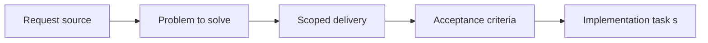

## item_062_harden_touch_input_ownership_against_camera_debug_gesture_leakage - Harden touch input ownership against camera debug gesture leakage
> From version: 0.1.0
> Status: Done
> Understanding: 98%
> Confidence: 96%
> Progress: 100%
> Complexity: Medium
> Theme: Quality
> Reminder: Update status/understanding/confidence/progress and linked task references when you edit this doc.

# Problem
- The mobile steering loop currently allows touch-based camera debug gestures to leak into player-facing runtime behavior.
- This slice hardens touch input ownership so the first gameplay loop keeps touch focused on entity steering unless camera debug behavior is explicitly allowed.

# Scope
- In: Touch gesture ownership, debug-camera gating for touch gestures, and compatibility with the first mobile steering loop.
- Out: Reworking the full camera system, changing desktop controls, or redesigning the virtual stick.

# Acceptance criteria
- AC1: Player-facing touch steering no longer triggers camera pan, zoom, or rotation when camera debug mode is not active.
- AC2: Any allowed touch-based camera gesture path remains clearly debug-gated rather than always available in the main loop.
- AC3: The change remains compatible with the current single-entity mobile steering model and browser smoke strategy.
- AC4: The slice stays aligned with the runtime input-isolation and camera-contract ADRs.
- AC5: The change does not broaden input scope into new gesture families or product redesign.

# AC Traceability
- AC1 -> Scope: Touch steering no longer leaks into camera debug gestures. Proof: `src/game/camera/hooks/useCameraController.ts`, `src/game/camera/hooks/useCameraController.test.tsx`.
- AC2 -> Scope: Camera gestures are explicitly gated for debug use. Proof: `src/game/camera/hooks/useCameraController.ts`.
- AC3 -> Scope: The mobile steering loop and smoke strategy remain valid. Proof: `src/game/input/hooks/useMobileVirtualStick.ts`, `scripts/testing/runBrowserSmoke.mjs`.
- AC4 -> Scope: The fix remains aligned with the input and camera contracts. Proof: `src/game/camera/hooks/useCameraController.ts`, `logics/architecture/adr_007_isolate_runtime_input_from_browser_page_controls.md`.
- AC5 -> Scope: The slice stays a hardening change rather than a control redesign. Proof: `src/game/camera/hooks/useCameraController.ts`.

# Decision framing
- Product framing: Required
- Product signals: engagement loop, navigation and discoverability
- Product follow-up: Keep the first mobile loop readable and reliable before adding richer controls.
- Architecture framing: Required
- Architecture signals: runtime and boundaries, contracts and integration
- Architecture follow-up: Keep alignment with `adr_003` and `adr_007`.

# Links
- Product brief(s): `prod_000_initial_single_entity_navigation_loop`
- Architecture decision(s): `adr_003_define_coordinate_spaces_and_camera_contract`, `adr_007_isolate_runtime_input_from_browser_page_controls`
- Request: `req_016_harden_runtime_interaction_state_release_readiness_and_bundle_risk`
- Primary task(s): `task_024_orchestrate_runtime_hardening_for_input_state_release_and_bundle_risk`

# Priority
- Impact: High
- Urgency: High

# Notes
- Derived from request `req_016_harden_runtime_interaction_state_release_readiness_and_bundle_risk`.
- Source file: `logics/request/req_016_harden_runtime_interaction_state_release_readiness_and_bundle_risk.md`.
- Request context seeded into this backlog item from `logics/request/req_016_harden_runtime_interaction_state_release_readiness_and_bundle_risk.md`.
- Completed in `task_024_orchestrate_runtime_hardening_for_input_state_release_and_bundle_risk`.
