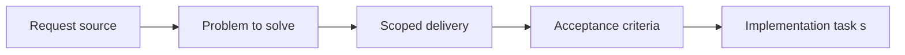

## item_063_separate_entity_selection_presentation_from_simulation_state - Separate entity selection presentation from simulation state
> From version: 0.1.0
> Status: Done
> Understanding: 98%
> Confidence: 96%
> Progress: 100%
> Complexity: Medium
> Theme: Quality
> Reminder: Update status/understanding/confidence/progress and linked task references when you edit this doc.

# Problem
- The runtime currently overwrites an entity's simulation state when that entity is selected for inspection.
- This slice restores state integrity by separating selection or inspection presentation from the entity's real simulation state.

# Scope
- In: Selection state modeling, inspection-panel compatibility, diagnostics compatibility, and runtime-state integrity.
- Out: Reworking the whole entity state machine, redesigning inspection UI, or introducing a full UI-state framework.

# Acceptance criteria
- AC1: Selecting an entity no longer destroys or masks its underlying simulation state such as `idle`, `moving`, or `inactive`.
- AC2: Selection or inspection status remains available for rendering and UI purposes through a mechanism separate from simulation state.
- AC3: Diagnostics and browser smoke remain compatible with the corrected state model.
- AC4: The change stays compatible with the current entity contract, inspection surfaces, and debug-oriented selection workflow.
- AC5: The slice stays focused on state integrity and does not expand into broader gameplay-state redesign.

# AC Traceability
- AC1 -> Scope: The runtime preserves the real simulation state of selected entities. Proof: `src/game/entities/hooks/useEntityWorld.ts`, `src/game/entities/hooks/useEntityWorld.test.tsx`.
- AC2 -> Scope: Selection remains available through a separate presentation mechanism. Proof: `src/game/entities/model/entityContract.ts`, `src/game/entities/render/EntityScene.tsx`, `src/app/components/EntityInspectionPanel.tsx`.
- AC3 -> Scope: Diagnostics and browser smoke stay compatible with the corrected state model. Proof: `src/game/debug/ShellDiagnosticsPanel.tsx`, `scripts/testing/runBrowserSmoke.mjs`.
- AC4 -> Scope: The change remains compatible with current entity and inspection contracts. Proof: `src/app/AppShell.tsx`, `src/app/components/EntityInspectionPanel.tsx`, `src/game/entities/render/EntityScene.tsx`.
- AC5 -> Scope: The slice stays limited to state hardening. Proof: `src/game/entities/hooks/useEntityWorld.ts`.

# Decision framing
- Product framing: Required
- Product signals: engagement loop, navigation and discoverability
- Product follow-up: Preserve trustworthy player-facing and debug-facing state readouts before deeper gameplay systems arrive.
- Architecture framing: Required
- Architecture signals: runtime and boundaries, contracts and integration
- Architecture follow-up: Keep alignment with current entity-model and diagnostics contracts.

# Links
- Product brief(s): `prod_000_initial_single_entity_navigation_loop`, `prod_002_readable_world_traversal_and_presence`
- Architecture decision(s): `adr_003_define_coordinate_spaces_and_camera_contract`
- Request: `req_016_harden_runtime_interaction_state_release_readiness_and_bundle_risk`
- Primary task(s): `task_024_orchestrate_runtime_hardening_for_input_state_release_and_bundle_risk`

# Priority
- Impact: High
- Urgency: High

# Notes
- Derived from request `req_016_harden_runtime_interaction_state_release_readiness_and_bundle_risk`.
- Source file: `logics/request/req_016_harden_runtime_interaction_state_release_readiness_and_bundle_risk.md`.
- Request context seeded into this backlog item from `logics/request/req_016_harden_runtime_interaction_state_release_readiness_and_bundle_risk.md`.
- Completed in `task_024_orchestrate_runtime_hardening_for_input_state_release_and_bundle_risk`.
