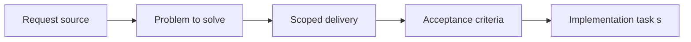

## item_064_enforce_release_readiness_against_release_branch_and_required_gates - Enforce release readiness against release branch and required gates
> From version: 0.1.0
> Status: Done
> Understanding: 98%
> Confidence: 96%
> Progress: 100%
> Complexity: Medium
> Theme: Delivery
> Reminder: Update status/understanding/confidence/progress and linked task references when you edit this doc.

# Problem
- The documented release-readiness posture is stronger than the current helper command actually enforces.
- This slice tightens the release-readiness behavior so commands, docs, and branch policy all mean the same thing.

# Scope
- In: Release-readiness command semantics, release-branch enforcement, required validation gates, and alignment with current release docs.
- Out: Reworking versioning policy, changing Render Blueprint behavior, or expanding release automation beyond the current static-site scale.

# Acceptance criteria
- AC1: Release-readiness behavior aligns with the documented `release`-branch contract instead of silently weakening it.
- AC2: Required validation gates are enforced or verified explicitly rather than only printed as advisory output.
- AC3: The slice remains compatible with the current changelog contract, CI pipeline, and static Render deployment posture.
- AC4: The command behavior clearly distinguishes advisory local checks from real release-branch readiness, if both remain necessary.
- AC5: The change stays pragmatic for the current project stage and does not introduce heavy release orchestration.

# AC Traceability
- AC1 -> Scope: Release readiness aligns with the documented release-branch contract. Proof: `scripts/release/verifyReleaseReadiness.mjs`, `README.md`, `logics/architecture/adr_013_use_a_dedicated_release_branch_for_deployable_static_releases.md`.
- AC2 -> Scope: Required checks are explicitly enforced or verified. Proof: `scripts/release/verifyReleaseReadiness.mjs`, `package.json`.
- AC3 -> Scope: The slice remains compatible with changelog, CI, and Render contracts. Proof: `scripts/release/verifyReleaseReadiness.mjs`, `.github/workflows/ci.yml`, `README.md`.
- AC4 -> Scope: Advisory and strict readiness modes are clearly separated if both exist. Proof: `package.json`, `scripts/release/verifyReleaseReadiness.mjs`.
- AC5 -> Scope: The change stays lightweight for the current delivery model. Proof: `scripts/release/verifyReleaseReadiness.mjs`.

# Decision framing
- Product framing: Not needed
- Product signals: (none detected)
- Product follow-up: No product brief follow-up is expected based on current signals.
- Architecture framing: Required
- Architecture signals: delivery and operations
- Architecture follow-up: Keep alignment with `adr_012` and `adr_013`.

# Links
- Product brief(s): (none yet)
- Architecture decision(s): `adr_012_require_curated_versioned_changelogs_for_releases`, `adr_013_use_a_dedicated_release_branch_for_deployable_static_releases`
- Request: `req_016_harden_runtime_interaction_state_release_readiness_and_bundle_risk`
- Primary task(s): `task_024_orchestrate_runtime_hardening_for_input_state_release_and_bundle_risk`

# Priority
- Impact: High
- Urgency: High

# Notes
- Derived from request `req_016_harden_runtime_interaction_state_release_readiness_and_bundle_risk`.
- Source file: `logics/request/req_016_harden_runtime_interaction_state_release_readiness_and_bundle_risk.md`.
- Request context seeded into this backlog item from `logics/request/req_016_harden_runtime_interaction_state_release_readiness_and_bundle_risk.md`.
- Completed in `task_024_orchestrate_runtime_hardening_for_input_state_release_and_bundle_risk`.
