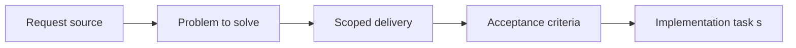

## item_065_capture_and_reduce_pixi_bundle_warning_risk - Capture and reduce Pixi bundle warning risk
> From version: 0.1.0
> Status: Done
> Understanding: 97%
> Confidence: 94%
> Progress: 100%
> Complexity: Medium
> Theme: Performance
> Reminder: Update status/understanding/confidence/progress and linked task references when you edit this doc.

# Problem
- The runtime builds successfully, but the main Pixi bundle still exceeds Vite's chunk-size warning threshold.
- This slice turns that residual warning into an explicit delivery or performance risk with a follow-up direction instead of leaving it as background noise.

# Scope
- In: Bundle-risk framing, profiling expectations, first mitigation direction, and compatibility with the current static delivery model.
- Out: Full rendering-architecture rewrite, premature micro-optimization, or broad asset-pipeline redesign.

# Acceptance criteria
- AC1: The current Pixi bundle-size warning is documented as an explicit residual risk rather than an informal note.
- AC2: The slice defines a first follow-up direction such as chunk splitting, import narrowing, or render/runtime partitioning review.
- AC3: The change remains compatible with the existing performance-budget and static-delivery requests.
- AC4: The slice preserves the distinction between a current warning and a proven user-facing regression.
- AC5: The work stays scoped to bundle-risk capture and initial mitigation direction rather than broad optimization churn.

# AC Traceability
- AC1 -> Scope: The Pixi bundle warning is tracked as an explicit residual risk. Proof: `README.md`, `logics/tasks/task_024_orchestrate_runtime_hardening_for_input_state_release_and_bundle_risk.md`.
- AC2 -> Scope: A first mitigation direction is defined. Proof: `vite.config.ts`, `README.md`.
- AC3 -> Scope: The slice remains compatible with current performance and delivery contracts. Proof: `vite.config.ts`, `README.md`.
- AC4 -> Scope: The warning is framed accurately rather than overstated. Proof: `README.md`.
- AC5 -> Scope: The work stays limited to risk capture and first mitigation direction. Proof: `vite.config.ts`, `README.md`.

# Decision framing
- Product framing: Consider
- Product signals: engagement loop
- Product follow-up: Keep startup and runtime growth sustainable before density-heavy gameplay expands the client workload.
- Architecture framing: Required
- Architecture signals: delivery and operations, runtime and boundaries
- Architecture follow-up: Keep alignment with the performance and static-delivery requests.

# Links
- Product brief(s): `prod_003_high_density_top_down_survival_action_direction`
- Architecture decision(s): (none yet)
- Request: `req_016_harden_runtime_interaction_state_release_readiness_and_bundle_risk`
- Primary task(s): `task_024_orchestrate_runtime_hardening_for_input_state_release_and_bundle_risk`

# Priority
- Impact: Medium
- Urgency: Medium

# Notes
- Derived from request `req_016_harden_runtime_interaction_state_release_readiness_and_bundle_risk`.
- Source file: `logics/request/req_016_harden_runtime_interaction_state_release_readiness_and_bundle_risk.md`.
- Request context seeded into this backlog item from `logics/request/req_016_harden_runtime_interaction_state_release_readiness_and_bundle_risk.md`.
- Completed in `task_024_orchestrate_runtime_hardening_for_input_state_release_and_bundle_risk`.
