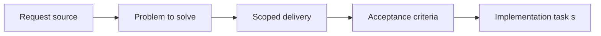

## item_066_define_floating_shell_menu_actions_for_fullscreen_and_camera_reset - Define floating shell menu actions for fullscreen and camera reset
> From version: 0.1.3
> Status: Done
> Understanding: 98%
> Confidence: 95%
> Progress: 100%
> Complexity: Medium
> Theme: UX
> Reminder: Update status/understanding/confidence/progress and linked task references when you edit this doc.

# Problem
- Fullscreen and camera-reset actions are currently exposed as separate persistent controls instead of living behind the new menu-first shell posture.
- This slice defines how the floating shell menu owns those system actions so the runtime can stay visually quiet while keeping core shell controls accessible.

# Scope
- In: Floating-menu entries for `fullscreen` and `reset camera`, action labeling, behavior rules, and compatibility with the current fullscreen and camera controllers.
- Out: Diagnostics visibility, inspection presentation, or broader menu styling beyond what is needed to make these actions usable.

# Acceptance criteria
- AC1: `fullscreen` and `reset camera` are exposed through the floating shell menu rather than as separate always-visible top-level controls.
- AC2: The `fullscreen` action remains an explicit user-triggered shell action compatible with the browser Fullscreen API and existing fallback behavior.
- AC3: The `reset camera` action remains available without reintroducing persistent overlay clutter.
- AC4: Both actions are reachable from the same menu posture on mobile and desktop.
- AC5: The action ownership remains in the DOM shell layer and does not leak interaction responsibility into the world render surface.

# AC Traceability
- AC1 -> Scope: Fullscreen and reset-camera controls move under one shell menu. Proof: `src/app/AppShell.tsx`, `src/app/components/ShellMenu.tsx`.
- AC2 -> Scope: Fullscreen behavior stays explicit and compatible with the current controller. Proof: `src/app/hooks/useFullscreenController.ts`, `src/app/AppShell.tsx`.
- AC3 -> Scope: Camera reset stays accessible without permanent extra chrome. Proof: `src/game/camera/hooks/useCameraController.ts`, `src/app/components/ShellMenu.tsx`, `src/app/AppShell.tsx`.
- AC4 -> Scope: One menu action model covers mobile and desktop. Proof: `src/app/styles/app.css`, `src/app/AppShell.tsx`.
- AC5 -> Scope: Action ownership stays inside the shell DOM layer. Proof: `src/app/AppShell.tsx`, `src/game/render/RuntimeSurface.tsx`.

# Decision framing
- Product framing: Required
- Product signals: navigation and discoverability
- Product follow-up: Keep the menu action list minimal so shell controls stay useful instead of turning into a settings drawer.
- Architecture framing: Not needed
- Architecture signals: (none detected)
- Architecture follow-up: No architecture decision follow-up is expected based on current signals.

# Links
- Product brief(s): `prod_001_minimal_overlay_and_feedback_for_early_runtime`
- Architecture decision(s): `adr_002_separate_react_shell_from_pixi_runtime_ownership`, `adr_007_isolate_runtime_input_from_browser_page_controls`
- Request: `req_017_redesign_runtime_overlay_into_a_single_floating_menu`
- Primary task(s): `task_025_orchestrate_runtime_overlay_simplification_around_a_floating_menu`

# Priority
- Impact: Medium
- Urgency: Medium

# Notes
- Derived from request `req_017_redesign_runtime_overlay_into_a_single_floating_menu`.
- Source file: `logics/request/req_017_redesign_runtime_overlay_into_a_single_floating_menu.md`.
- Request context seeded into this backlog item from `logics/request/req_017_redesign_runtime_overlay_into_a_single_floating_menu.md`.
- Completed through `task_025_orchestrate_runtime_overlay_simplification_around_a_floating_menu`.
