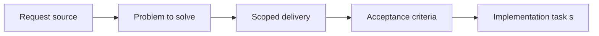

## item_067_define_menu_driven_diagnostics_access_and_debug_gating - Define menu driven diagnostics access and debug gating
> From version: 0.1.3
> Status: Done
> Understanding: 98%
> Confidence: 95%
> Progress: 100%
> Complexity: Medium
> Theme: UX
> Reminder: Update status/understanding/confidence/progress and linked task references when you edit this doc.

# Problem
- Diagnostics are useful for development, but the current shell posture makes them too easy to treat as default runtime chrome.
- This slice defines a menu-driven diagnostics access model with explicit debug gating so developer tooling stays available without polluting the player-facing view.

# Scope
- In: Diagnostics visibility rules, debug gating, menu-entry behavior, and compatibility with the existing diagnostics panel and shell preferences.
- Out: Detailed metric design, profiling workflows, or player-facing HUD content unrelated to diagnostics access.

# Acceptance criteria
- AC1: Diagnostics are hidden by default in the runtime and are no longer treated as always-visible shell content.
- AC2: Diagnostics visibility is controlled through the floating shell menu rather than through separate persistent controls.
- AC3: The menu exposes diagnostics only in debug-capable conditions and does not present a broken or misleading diagnostics action where the feature should stay unavailable.
- AC4: Diagnostics remain clearly separated from player-facing runtime chrome and from the inspecteur surface.
- AC5: The diagnostics access model remains compatible with current shell preferences and the existing diagnostics panel implementation.

# AC Traceability
- AC1 -> Scope: Diagnostics no longer occupy baseline runtime space. Proof: `src/app/AppShell.tsx`, `src/app/styles/app.css`.
- AC2 -> Scope: Diagnostics visibility is routed through the shell menu. Proof: `src/app/components/ShellMenu.tsx`, `src/app/AppShell.tsx`.
- AC3 -> Scope: Debug gating controls whether diagnostics are offered. Proof: `src/shared/config/appConfig.ts`, `src/app/AppShell.tsx`.
- AC4 -> Scope: Diagnostics stay distinct from player-facing and inspection surfaces. Proof: `src/game/debug/ShellDiagnosticsPanel.tsx`, `src/app/components/EntityInspectionPanel.tsx`, `src/app/AppShell.tsx`.
- AC5 -> Scope: Existing preference and diagnostics plumbing remains usable. Proof: `src/app/hooks/useShellPreferences.ts`, `src/game/debug/ShellDiagnosticsPanel.tsx`, `src/app/AppShell.tsx`.

# Decision framing
- Product framing: Required
- Product signals: navigation and discoverability
- Product follow-up: Keep diagnostics discoverable for testers without letting them become part of the default player presentation.
- Architecture framing: Not needed
- Architecture signals: (none detected)
- Architecture follow-up: No architecture decision follow-up is expected based on current signals.

# Links
- Product brief(s): `prod_001_minimal_overlay_and_feedback_for_early_runtime`
- Architecture decision(s): `adr_002_separate_react_shell_from_pixi_runtime_ownership`, `adr_006_standardize_debug_first_runtime_instrumentation`
- Request: `req_017_redesign_runtime_overlay_into_a_single_floating_menu`
- Primary task(s): `task_025_orchestrate_runtime_overlay_simplification_around_a_floating_menu`

# Priority
- Impact: Medium
- Urgency: Medium

# Notes
- Derived from request `req_017_redesign_runtime_overlay_into_a_single_floating_menu`.
- Source file: `logics/request/req_017_redesign_runtime_overlay_into_a_single_floating_menu.md`.
- Request context seeded into this backlog item from `logics/request/req_017_redesign_runtime_overlay_into_a_single_floating_menu.md`.
- Completed through `task_025_orchestrate_runtime_overlay_simplification_around_a_floating_menu`.
