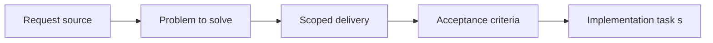

## item_068_define_minimal_runtime_chrome_and_single_menu_trigger_baseline - Define minimal runtime chrome and single menu trigger baseline
> From version: 0.1.3
> Status: Done
> Understanding: 98%
> Confidence: 95%
> Progress: 100%
> Complexity: Medium
> Theme: UX
> Reminder: Update status/understanding/confidence/progress and linked task references when you edit this doc.

# Problem
- The current runtime keeps too much non-essential chrome visible, which weakens readability on mobile and still adds noise on desktop.
- This slice defines the new baseline shell posture: a visually dominant world surface with one persistent menu trigger instead of multiple permanent labels, cards, and buttons.

# Scope
- In: Minimal default runtime chrome, top-right menu trigger placement, removal of redundant always-visible labels, and baseline visibility rules for the shell.
- Out: Specific menu-action behaviors, diagnostics details, or the full inspection-panel contract.

# Acceptance criteria
- AC1: The baseline runtime view keeps the world visually dominant and limits permanent chrome to a compact menu trigger.
- AC2: The persistent menu trigger is placed in the top-right corner on mobile and desktop unless a later request explicitly changes that posture.
- AC3: The always-visible labels `Emberwake runtime` and `Movement-first loop` are removed from the default runtime presentation.
- AC4: Existing player-facing cards and redundant top-level shell controls are removed from the baseline view rather than merely restyled.
- AC5: The new minimal chrome posture remains compatible with the fullscreen shell, safe-area handling, and thin DOM overlay ownership.

# AC Traceability
- AC1 -> Scope: Default runtime chrome shrinks to a menu-first shell posture. Proof: `src/app/AppShell.tsx`, `src/app/styles/app.css`.
- AC2 -> Scope: The menu trigger has a stable default placement across layouts. Proof: `src/app/styles/app.css`, `src/app/AppShell.tsx`.
- AC3 -> Scope: Redundant runtime labels are removed from the baseline UI. Proof: `src/app/AppShell.tsx`, `src/app/components/PlayerHudCard.tsx`.
- AC4 -> Scope: The previous persistent cards and top-level controls no longer define the default runtime screen. Proof: `src/app/AppShell.tsx`, `src/app/styles/app.css`.
- AC5 -> Scope: Simplification preserves the shell and overlay ownership contract. Proof: `src/app/hooks/useLogicalViewportModel.ts`, `src/app/styles/app.css`, `src/app/AppShell.tsx`.

# Decision framing
- Product framing: Required
- Product signals: navigation and discoverability
- Product follow-up: Keep the baseline screen severe about what earns permanent visibility.
- Architecture framing: Not needed
- Architecture signals: (none detected)
- Architecture follow-up: No architecture decision follow-up is expected based on current signals.

# Links
- Product brief(s): `prod_001_minimal_overlay_and_feedback_for_early_runtime`, `prod_002_readable_world_traversal_and_presence`
- Architecture decision(s): `adr_002_separate_react_shell_from_pixi_runtime_ownership`
- Request: `req_017_redesign_runtime_overlay_into_a_single_floating_menu`
- Primary task(s): `task_025_orchestrate_runtime_overlay_simplification_around_a_floating_menu`

# Priority
- Impact: High
- Urgency: High

# Notes
- Derived from request `req_017_redesign_runtime_overlay_into_a_single_floating_menu`.
- Source file: `logics/request/req_017_redesign_runtime_overlay_into_a_single_floating_menu.md`.
- Request context seeded into this backlog item from `logics/request/req_017_redesign_runtime_overlay_into_a_single_floating_menu.md`.
- Completed through `task_025_orchestrate_runtime_overlay_simplification_around_a_floating_menu`.
