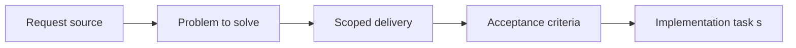

## item_069_define_menu_driven_inspection_presentation_across_mobile_and_desktop - Define menu driven inspection presentation across mobile and desktop
> From version: 0.1.3
> Status: Done
> Understanding: 98%
> Confidence: 95%
> Progress: 100%
> Complexity: Medium
> Theme: UX
> Reminder: Update status/understanding/confidence/progress and linked task references when you edit this doc.

# Problem
- The inspecteur is useful, but it should no longer occupy the runtime by default or compete with movement and world readability.
- This slice defines a menu-driven inspection presentation that stays contextual, opens on demand, and adapts differently on desktop and mobile.

# Scope
- In: Menu entry for `inspecteur`, default hidden state, desktop floating-panel posture, mobile bottom-sheet posture, and compatibility with the selected-entity model.
- Out: Selection mechanics, diagnostics behavior, or broader command systems beyond contextual inspection visibility.

# Acceptance criteria
- AC1: The inspecteur is hidden by default and is revealed only after an explicit user choice through the floating shell menu.
- AC2: The inspecteur uses a compact floating-panel posture on desktop.
- AC3: The inspecteur uses a bottom-sheet posture on mobile.
- AC4: The inspection presentation remains contextual and avoids reclaiming a large permanent share of the runtime surface.
- AC5: The inspection surface remains DOM-owned and compatible with the existing selected-entity data flow.

# AC Traceability
- AC1 -> Scope: Inspection visibility is menu-driven instead of always-on. Proof: `src/app/components/ShellMenu.tsx`, `src/app/AppShell.tsx`.
- AC2 -> Scope: Desktop uses a floating inspection panel. Proof: `src/app/components/EntityInspectionPanel.tsx`, `src/app/styles/app.css`.
- AC3 -> Scope: Mobile uses a bottom-sheet inspection posture. Proof: `src/app/components/EntityInspectionPanel.tsx`, `src/app/styles/app.css`.
- AC4 -> Scope: Inspection remains contextual and restrained. Proof: `src/app/AppShell.tsx`, `src/app/styles/app.css`.
- AC5 -> Scope: Inspection stays wired to the existing selected-entity state without moving into the world renderer. Proof: `src/game/entities/hooks/useEntityWorld.ts`, `src/app/components/EntityInspectionPanel.tsx`, `src/app/AppShell.tsx`.

# Decision framing
- Product framing: Required
- Product signals: navigation and discoverability
- Product follow-up: Keep inspection useful for testers while making sure it still feels optional in the baseline runtime.
- Architecture framing: Not needed
- Architecture signals: (none detected)
- Architecture follow-up: No architecture decision follow-up is expected based on current signals.

# Links
- Product brief(s): `prod_001_minimal_overlay_and_feedback_for_early_runtime`
- Architecture decision(s): `adr_002_separate_react_shell_from_pixi_runtime_ownership`
- Request: `req_017_redesign_runtime_overlay_into_a_single_floating_menu`
- Primary task(s): `task_025_orchestrate_runtime_overlay_simplification_around_a_floating_menu`

# Priority
- Impact: High
- Urgency: Medium

# Notes
- Derived from request `req_017_redesign_runtime_overlay_into_a_single_floating_menu`.
- Source file: `logics/request/req_017_redesign_runtime_overlay_into_a_single_floating_menu.md`.
- Request context seeded into this backlog item from `logics/request/req_017_redesign_runtime_overlay_into_a_single_floating_menu.md`.
- Completed through `task_025_orchestrate_runtime_overlay_simplification_around_a_floating_menu`.
