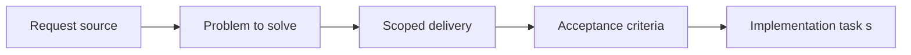

## item_070_define_target_repository_topology_for_engine_runtime_and_game_modules - Define target repository topology for engine runtime and game modules
> From version: 0.1.3
> Status: Done
> Understanding: 99%
> Confidence: 96%
> Progress: 100%
> Complexity: Medium
> Theme: Architecture
> Reminder: Update status/understanding/confidence/progress and linked task references when you edit this doc.

# Problem
- The repository currently has useful domain boundaries, but it does not yet expose a clear top-level ownership model for `app shell`, reusable runtime code, and Emberwake-specific gameplay.
- Without an explicit topology target, later extraction work will likely move files inconsistently and create new boundary drift instead of reducing it.

# Scope
- In: Target repository or source topology, ownership zones, migration-safe placement rules, and clear boundaries between `app`, `engine`, and `game`.
- Out: Full code extraction, final package publishing strategy, or implementation of engine-to-game contracts in depth.

# Acceptance criteria
- AC1: The slice defines an explicit target topology for the repository, such as `apps`, `packages`, and `games`, or another equally concrete ownership model.
- AC2: The topology reserves separate top-level ownership for at least the web shell, reusable engine runtime code, and Emberwake gameplay code.
- AC3: The topology remains compatible with an in-repository modularization strategy rather than requiring an immediate multi-repository split.
- AC4: The topology preserves the current `React shell` and `Pixi runtime` ownership posture instead of blurring them during the refactor.
- AC5: The slice defines practical placement rules for current modules so future extraction work has a stable destination instead of ad hoc moves.

# AC Traceability
- AC1 -> Scope: A concrete repository topology is chosen and documented. Proof target: `apps/emberwake-web`, `packages/engine-core`, `packages/engine-pixi`, `games/emberwake`, `README.md`, `logics/architecture`.
- AC2 -> Scope: Ownership zones exist for shell, engine, and game. Proof target: repository tree, package boundaries, import paths, updated architecture docs.
- AC3 -> Scope: The refactor is staged inside the same repository. Proof target: workspace layout, package manifests if introduced, updated request and task docs.
- AC4 -> Scope: Shell and runtime ownership stay consistent with existing ADRs. Proof target: `logics/architecture/adr_002_separate_react_shell_from_pixi_runtime_ownership.md`, updated repository structure, runtime entrypoints.
- AC5 -> Scope: Current modules have a documented destination rule. Proof target: migration notes, backlog follow-ups, updated architecture or task docs.

# Decision framing
- Product framing: Consider
- Product signals: engagement loop
- Product follow-up: Keep the topology refactor in service of shipping Emberwake rather than creating an isolated tooling project.
- Architecture framing: Required
- Architecture signals: runtime and boundaries, contracts and integration
- Architecture follow-up: Capture the target topology in an ADR before broad file moves begin.

# Links
- Product brief(s): `prod_000_initial_single_entity_navigation_loop`, `prod_003_high_density_top_down_survival_action_direction`
- Architecture decision(s): `adr_000_adopt_feature_oriented_organic_frontend_structure`, `adr_002_separate_react_shell_from_pixi_runtime_ownership`
- Request: `req_018_define_engine_and_gameplay_boundary_for_runtime_reuse`
- Primary task(s): `task_026_orchestrate_engine_gameplay_boundary_extraction_for_runtime_reuse`

# Priority
- Impact: High
- Urgency: High

# Notes
- Derived from request `req_018_define_engine_and_gameplay_boundary_for_runtime_reuse`.
- Source file: `logics/request/req_018_define_engine_and_gameplay_boundary_for_runtime_reuse.md`.
- Recommended default topology from the request: `apps/emberwake-web`, `packages/engine-core`, `packages/engine-pixi`, and `games/emberwake`.
- Implemented with repository-level ownership materialized under `apps/emberwake-web`, `packages/engine-core`, `packages/engine-pixi`, and `games/emberwake`, with task traceability captured in `task_026_orchestrate_engine_gameplay_boundary_extraction_for_runtime_reuse`.
