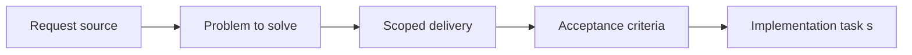

## item_071_define_engine_to_game_contracts_for_update_render_and_input_integration - Define engine to game contracts for update render and input integration
> From version: 0.1.3
> Status: Done
> Understanding: 99%
> Confidence: 96%
> Progress: 100%
> Complexity: High
> Theme: Architecture
> Reminder: Update status/understanding/confidence/progress and linked task references when you edit this doc.

# Problem
- The runtime cannot be cleanly reused if engine-owned systems directly know about Emberwake entities, state unions, content definitions, or gameplay rules.
- A stable engine or game split requires narrow contracts for initialization, update flow, input mapping, and render presentation before deeper extraction begins.

# Scope
- In: Engine-to-game boundaries for initialization, update lifecycle, normalized input handoff, and render-data presentation.
- Out: Full gameplay implementation rewrite, plugin system design, or speculative abstraction for many unrelated genres.

# Acceptance criteria
- AC1: The slice defines a minimum contract between engine and gameplay for runtime initialization.
- AC2: The slice defines a minimum contract between engine and gameplay for fixed-step or frame-based update execution without embedding Emberwake-specific logic into the engine.
- AC3: The slice defines how low-level input owned by the engine becomes gameplay-meaningful actions without the engine owning those meanings.
- AC4: The slice defines how gameplay-owned state becomes engine-consumable render presentation data without the engine depending on Emberwake content rules.
- AC5: The slice keeps the first contract intentionally narrow and avoids prematurely introducing a broad plugin architecture.

# AC Traceability
- AC1 -> Scope: Initialization ownership is explicit. Proof target: engine bootstrap interfaces, game module entrypoints, runtime wiring docs.
- AC2 -> Scope: Update lifecycle boundaries are explicit. Proof target: simulation contracts, engine runtime loop integration, task report.
- AC3 -> Scope: Input capture and action mapping are separated cleanly. Proof target: input contracts, game action mapping modules, updated architecture docs.
- AC4 -> Scope: Render presentation data crosses the boundary without leaking Emberwake rules into engine modules. Proof target: scene contracts, presentation types, runtime rendering adapters.
- AC5 -> Scope: The contract stays narrow and pragmatic. Proof target: public interfaces, ADR text, absence of speculative plugin subsystems.

# Decision framing
- Product framing: Consider
- Product signals: engagement loop, navigation and discoverability
- Product follow-up: Keep the contract small enough that gameplay iteration speed does not collapse under architecture ceremony.
- Architecture framing: Required
- Architecture signals: contracts and integration, runtime and boundaries
- Architecture follow-up: Create an ADR or spec for the contract before broad extraction of shared runtime modules.

# Links
- Product brief(s): `prod_000_initial_single_entity_navigation_loop`, `prod_003_high_density_top_down_survival_action_direction`
- Architecture decision(s): `adr_003_define_coordinate_spaces_and_camera_contract`, `adr_004_run_simulation_on_a_fixed_timestep`, `adr_007_isolate_runtime_input_from_browser_page_controls`
- Request: `req_018_define_engine_and_gameplay_boundary_for_runtime_reuse`
- Primary task(s): `task_026_orchestrate_engine_gameplay_boundary_extraction_for_runtime_reuse`

# Priority
- Impact: High
- Urgency: High

# Notes
- Derived from request `req_018_define_engine_and_gameplay_boundary_for_runtime_reuse`.
- Source file: `logics/request/req_018_define_engine_and_gameplay_boundary_for_runtime_reuse.md`.
- Recommended default from the request: keep the first engine-to-game contract narrow around `initialize`, `update`, `present render data`, and `map input`.
- Implemented with the first contract materialized in `packages/engine-core/src/contracts/gameModule.ts`, `games/emberwake/src/runtime/emberwakeGameModule.ts`, and `spec_000_define_initial_engine_to_game_typescript_contract_shapes`.
