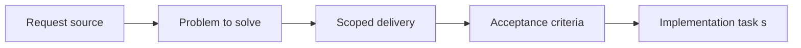

## item_074_define_incremental_migration_and_validation_strategy_for_engine_gameplay_extraction - Define incremental migration and validation strategy for engine gameplay extraction
> From version: 0.1.3
> Status: Done
> Understanding: 99%
> Confidence: 97%
> Progress: 100%
> Complexity: Medium
> Theme: Operations
> Reminder: Update status/understanding/confidence/progress and linked task references when you edit this doc.

# Problem
- Even a well-scoped engine or gameplay split can damage delivery if migration order, validation gates, and temporary dependency rules remain implicit.
- The extraction needs an explicit migration posture so the team can refactor safely without breaking the current playable runtime or relaxing release discipline.

# Scope
- In: Migration phases, temporary dependency rules, validation gates, runtime safety expectations, and release-safe rollout guidance for the engine or gameplay split.
- Out: The detailed implementation of every code move, final package publishing operations, or broad CI redesign unrelated to the extraction.

# Acceptance criteria
- AC1: The slice defines a staged migration order for topology, contracts, extraction, and game-layer isolation instead of treating the refactor as one large move.
- AC2: The slice defines temporary dependency rules that permit practical migration wiring while still forbidding `engine -> game` imports.
- AC3: The slice defines the validation bar that must stay green throughout migration, including at least `npm run ci`, `npm run test:browser:smoke`, and `npm run release:ready`.
- AC4: The slice defines what counts as acceptable temporary duplication or adapter code during migration and what should be rejected as lasting architecture drift.
- AC5: The migration strategy remains compatible with the current release-branch, changelog, and deployable-artifact posture.

# AC Traceability
- AC1 -> Scope: Migration phases are explicit and ordered. Proof target: task plan, migration notes, orchestration task docs.
- AC2 -> Scope: Temporary dependency rules are explicit. Proof target: architecture notes, task report, import-boundary review.
- AC3 -> Scope: Validation gates stay active during extraction. Proof target: `package.json`, CI runs, task validation report.
- AC4 -> Scope: Temporary adapters are bounded and intentional. Proof target: migration notes, TODO boundaries, cleanup follow-ups.
- AC5 -> Scope: Delivery posture remains intact. Proof target: `scripts/release`, `README.md`, release-readiness checks, changelog flow.

# Decision framing
- Product framing: Consider
- Product signals: conversion journey, engagement loop
- Product follow-up: Keep shipping cadence credible while the internal architecture changes.
- Architecture framing: Required
- Architecture signals: delivery and operations, runtime and boundaries
- Architecture follow-up: Treat validation and dependency rules as first-class architecture constraints, not afterthoughts.

# Links
- Product brief(s): `prod_000_initial_single_entity_navigation_loop`
- Architecture decision(s): `adr_012_require_curated_versioned_changelogs_for_releases`, `adr_013_use_a_dedicated_release_branch_for_deployable_static_releases`
- Request: `req_018_define_engine_and_gameplay_boundary_for_runtime_reuse`
- Primary task(s): `task_026_orchestrate_engine_gameplay_boundary_extraction_for_runtime_reuse`

# Priority
- Impact: High
- Urgency: High

# Notes
- Derived from request `req_018_define_engine_and_gameplay_boundary_for_runtime_reuse`.
- Source file: `logics/request/req_018_define_engine_and_gameplay_boundary_for_runtime_reuse.md`.
- Recommended default from the request: keep the current runtime playable and keep `npm run ci`, `npm run test:browser:smoke`, and `npm run release:ready` green throughout staged extraction work.
- Implemented with staged commits under `task_026_orchestrate_engine_gameplay_boundary_extraction_for_runtime_reuse`; `npm run ci` and `npm run test:browser:smoke` stay green on `main`, while `npm run release:ready` is validated as a branch guard that must be rerun from `release` before deployable promotion.
