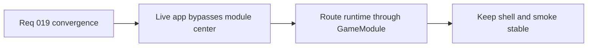

## item_075_route_live_runtime_through_engine_game_module_orchestration - Route live runtime through engine game module orchestration
> From version: 0.1.2
> Status: Done
> Understanding: 98%
> Confidence: 95%
> Progress: 100%
> Complexity: High
> Theme: Architecture
> Reminder: Update status/understanding/confidence/progress and linked task references when you edit this doc.

# Problem
- The intended engine-to-game runtime contract exists, but the live app still orchestrates most runtime behavior through app-owned hooks and transitional wiring.
- As long as the shipped runtime does not actually flow through the `GameModule` contract, the architecture remains only partially converged and future systems will keep reinforcing the hybrid model.

# Scope
- In: Live-runtime orchestration path, `GameModule` ownership in the active app flow, initialization and presentation wiring, and migration-safe replacement of parallel orchestration paths.
- Out: Broad gameplay redesign, final persistence expansion, or full removal of every transitional adapter in one step.

# Acceptance criteria
- AC1: The live runtime path uses the engine-to-game contract as the authoritative orchestration boundary for initialization, normalized input mapping, update progression, and presentation output.
- AC2: The app shell no longer duplicates game-state orchestration that should be owned by the engine or the game module.
- AC3: The slice preserves the existing `React shell owns overlays` posture while routing gameplay runtime flow through the contract boundary.
- AC4: The change stays compatible with the current playable single-entity runtime, diagnostics posture, and browser smoke expectations.
- AC5: The migration remains staged and avoids a stop-the-world rewrite of the entire runtime.

# AC Traceability
- AC1 -> Scope: The live app routes through `GameModule` instead of parallel hook orchestration. Proof target: runtime entry modules, `games/emberwake`, `packages/engine-core`, `src/app/AppShell.tsx`.
- AC2 -> Scope: App-owned orchestration is reduced to shell composition and adapter wiring. Proof target: `src/app`, runtime hooks, orchestration modules.
- AC3 -> Scope: React remains shell-owned while gameplay flow uses the engine boundary. Proof target: `src/app/AppShell.tsx`, engine runtime modules, ADR-aligned wiring.
- AC4 -> Scope: Existing runtime behavior remains valid after convergence. Proof target: `npm run test`, `npm run test:browser:smoke`, diagnostics panels, runtime scene behavior.
- AC5 -> Scope: The rollout is incremental rather than a rewrite. Proof target: migration notes, task plan, staged commits, preserved CI flow.

# Decision framing
- Product framing: Consider
- Product signals: engagement loop
- Product follow-up: Keep the player-visible loop stable while the runtime center of gravity moves under the hood.
- Architecture framing: Required
- Architecture signals: runtime and boundaries, contracts and integration
- Architecture follow-up: Treat the live orchestration path as the decisive architecture checkpoint for the modular split.

# Links
- Product brief(s): `prod_000_initial_single_entity_navigation_loop`
- Architecture decision(s): `adr_002_separate_react_shell_from_pixi_runtime_ownership`, `adr_015_define_engine_to_game_runtime_contract_boundaries`
- Request: `req_019_complete_runtime_convergence_and_harden_modular_architecture_boundaries`
- Primary task(s): `task_027_orchestrate_runtime_convergence_and_modular_boundary_hardening`

# Priority
- Impact: High
- Urgency: High

# Notes
- Derived from request `req_019_complete_runtime_convergence_and_harden_modular_architecture_boundaries`.
- Source file: `logics/request/req_019_complete_runtime_convergence_and_harden_modular_architecture_boundaries.md`.
- This item focuses on making the architecture real in the live app, not merely refining the contract shape on paper.
- Implemented through `task_027_orchestrate_runtime_convergence_and_modular_boundary_hardening`.
