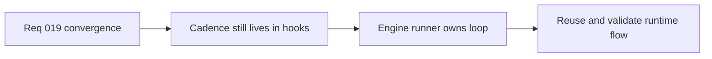

## item_076_extract_an_engine_owned_runtime_runner_for_fixed_step_input_update_and_present_flow - Extract an engine owned runtime runner for fixed step input update and present flow
> From version: 0.1.2
> Status: Done
> Understanding: 98%
> Confidence: 95%
> Progress: 100%
> Complexity: High
> Theme: Architecture
> Reminder: Update status/understanding/confidence/progress and linked task references when you edit this doc.

# Problem
- The project has fixed-step simulation requirements, but the active loop still lives primarily inside React hooks and browser-frame orchestration owned by the app layer.
- Without an engine-owned runtime runner, timing, input normalization, update cadence, and present-model production will remain difficult to reuse, validate, and scale.

# Scope
- In: Engine-owned runtime runner shape, fixed-step cadence ownership, normalized input flow, update/present sequencing, and shell-facing adapter surface.
- Out: Full scene-system redesign, advanced scheduler abstractions, or backend-style runtime infrastructure.

# Acceptance criteria
- AC1: The slice defines or implements a narrow engine-owned runtime runner that owns fixed-step progression and the `input -> mapInput -> update -> present` sequence.
- AC2: Timing and cadence logic no longer depend primarily on app-specific React hooks.
- AC3: The runner exposes a shell-facing surface that stays compatible with React-owned composition and DOM overlays without moving shell concerns into the engine.
- AC4: The runner remains pragmatic and narrow rather than expanding into a speculative plugin or universal-engine framework.
- AC5: The change remains compatible with current CI, browser smoke, and release-readiness expectations.

# AC Traceability
- AC1 -> Scope: A runtime runner exists at the engine boundary. Proof target: `packages/engine-core`, runtime orchestration modules, contract wiring.
- AC2 -> Scope: Cadence ownership is no longer primarily app-local. Proof target: previous hook orchestration replaced or reduced, engine-runner modules, timing utilities.
- AC3 -> Scope: React shell integration remains thin and explicit. Proof target: `src/app/AppShell.tsx`, shell adapters, engine runner API.
- AC4 -> Scope: The runner stays narrow and concrete. Proof target: runtime API shape, architecture notes, absence of premature plugin abstractions.
- AC5 -> Scope: Delivery discipline remains intact. Proof target: `package.json` scripts, CI runs, smoke validation, task validation notes.

# Decision framing
- Product framing: Consider
- Product signals: engagement loop
- Product follow-up: Preserve responsive player-facing behavior while moving cadence ownership to the right architectural layer.
- Architecture framing: Required
- Architecture signals: runtime and boundaries, contracts and integration
- Architecture follow-up: Record the minimal runtime-runner posture clearly so later systems build on a stable center.

# Links
- Product brief(s): `prod_000_initial_single_entity_navigation_loop`
- Architecture decision(s): `adr_004_run_simulation_on_a_fixed_timestep`, `adr_015_define_engine_to_game_runtime_contract_boundaries`
- Request: `req_019_complete_runtime_convergence_and_harden_modular_architecture_boundaries`
- Primary task(s): `task_027_orchestrate_runtime_convergence_and_modular_boundary_hardening`

# Priority
- Impact: High
- Urgency: High

# Notes
- Derived from request `req_019_complete_runtime_convergence_and_harden_modular_architecture_boundaries`.
- Source file: `logics/request/req_019_complete_runtime_convergence_and_harden_modular_architecture_boundaries.md`.
- Recommended default from the request: move decisively to a narrow engine-owned runtime runner rather than preserving a long-lived hybrid.
- Implemented through `task_027_orchestrate_runtime_convergence_and_modular_boundary_hardening`.
