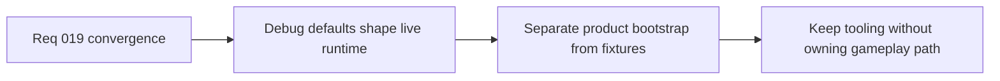

## item_079_separate_debug_fixtures_from_product_runtime_defaults_and_scene_bootstrapping - Separate debug fixtures from product runtime defaults and scene bootstrapping
> From version: 0.1.2
> Status: Ready
> Understanding: 98%
> Confidence: 95%
> Progress: 0%
> Complexity: Medium
> Theme: Architecture
> Reminder: Update status/understanding/confidence/progress and linked task references when you edit this doc.

# Problem
- The current runtime still leans on debug scenarios, debug-oriented content, and developer-facing visualization as structural defaults.
- That is acceptable for an early slice, but it weakens the distinction between product runtime behavior, test fixtures, and tooling-only inputs.

# Scope
- In: Separation of product defaults from debug fixtures, scene bootstrapping rules, fixture ownership, and compatibility with tests and diagnostics.
- Out: Full gameplay-loop definition, final art direction, or removal of useful debug tooling from the repository.

# Acceptance criteria
- AC1: Debug scenarios and fixtures are no longer the implicit default source of truth for the player-facing runtime bootstrap.
- AC2: Product runtime defaults, debug fixtures, and automated-test inputs have clearer ownership and loading posture.
- AC3: Debug tooling remains available and useful without structurally owning the shipping runtime path.
- AC4: The slice remains compatible with current diagnostics, smoke validation, and fixture-driven tests.
- AC5: The work stays scoped to architectural separation rather than turning into a full product redesign.

# AC Traceability
- AC1 -> Scope: Product runtime bootstrap is no longer debug-first. Proof target: runtime bootstrap modules, default scenario wiring, app initialization flow.
- AC2 -> Scope: Debug and product inputs have distinct ownership. Proof target: fixture directories, runtime defaults, scenario modules, docs.
- AC3 -> Scope: Debug tooling remains functional. Proof target: diagnostics panels, fixture tests, developer flows, smoke checks.
- AC4 -> Scope: Validation remains compatible with the separation. Proof target: `npm run test`, `npm run test:browser:smoke`, relevant fixture tests.
- AC5 -> Scope: The slice remains about runtime separation, not gameplay redesign. Proof target: task scope, limited file targets, architecture notes.

# Decision framing
- Product framing: Required
- Product signals: navigation and discoverability, engagement loop
- Product follow-up: Use the separation to prepare a real player-facing bootstrap without throwing away valuable debug tooling.
- Architecture framing: Required
- Architecture signals: runtime and boundaries, contracts and integration
- Architecture follow-up: Keep the distinction between debug fixtures and product defaults explicit in both code and docs.

# Links
- Product brief(s): `prod_000_initial_single_entity_navigation_loop`
- Architecture decision(s): `adr_015_define_engine_to_game_runtime_contract_boundaries`
- Request: `req_019_complete_runtime_convergence_and_harden_modular_architecture_boundaries`

# Priority
- Impact: High
- Urgency: Medium

# Notes
- Derived from request `req_019_complete_runtime_convergence_and_harden_modular_architecture_boundaries`.
- Source file: `logics/request/req_019_complete_runtime_convergence_and_harden_modular_architecture_boundaries.md`.
- Recommended default from the request: keep debug scenarios available as fixtures and tooling inputs, but not as the implicit player-facing runtime default.
