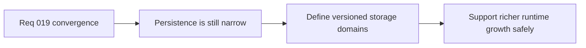

## item_080_define_domain_oriented_versioned_persistence_for_runtime_growth - Define domain oriented versioned persistence for runtime growth
> From version: 0.1.2
> Status: Ready
> Understanding: 97%
> Confidence: 94%
> Progress: 0%
> Complexity: Medium
> Theme: Architecture
> Reminder: Update status/understanding/confidence/progress and linked task references when you edit this doc.

# Problem
- The current persistence posture is versioned and intentionally narrow, but it is still centered on a small runtime-session slice and shell preferences.
- As gameplay, scenes, and runtime domains grow, the project needs a clearer domain-oriented persistence model or it will accumulate ad hoc storage rules and brittle migrations.

# Scope
- In: Domain-oriented storage posture, versioning strategy, migration expectations, bounded persistence domains, and compatibility with the static frontend model.
- Out: Backend sync, account systems, large save-game implementation, or persistence of every future gameplay system immediately.

# Acceptance criteria
- AC1: The slice defines a clearer domain-oriented persistence posture for future runtime growth instead of extending the current storage model ad hoc.
- AC2: The persistence model keeps explicit versioning and migration expectations for stored domains.
- AC3: The slice distinguishes lightweight shell or session preferences from richer gameplay-facing persistence domains.
- AC4: The design remains compatible with a static frontend and local-storage-first posture without assuming a backend.
- AC5: The work stays focused on persistence architecture and does not force immediate implementation of large gameplay saves.

# AC Traceability
- AC1 -> Scope: Persistence domains are modeled more explicitly. Proof target: storage modules, persistence docs, architecture notes, runtime contracts.
- AC2 -> Scope: Versioning and migration posture stay explicit. Proof target: storage schemas, migration helpers if introduced, docs.
- AC3 -> Scope: Shell/session and gameplay domains are distinct. Proof target: module boundaries, storage keys, runtime state contracts.
- AC4 -> Scope: Static-hosting posture remains intact. Proof target: local storage usage, README notes, no backend dependencies introduced.
- AC5 -> Scope: The slice remains architectural and bounded. Proof target: scoped backlog/task plan, absence of broad save-system implementation churn.

# Decision framing
- Product framing: Consider
- Product signals: engagement loop
- Product follow-up: Prepare persistence for richer play sessions without overcommitting to long-term save design too early.
- Architecture framing: Required
- Architecture signals: contracts and integration, delivery and operations
- Architecture follow-up: Treat storage evolution as a contract surface, not just a utility concern.

# Links
- Product brief(s): `prod_000_initial_single_entity_navigation_loop`
- Architecture decision(s): `adr_010_treat_render_build_variables_as_public_frontend_configuration`
- Request: `req_019_complete_runtime_convergence_and_harden_modular_architecture_boundaries`

# Priority
- Impact: Medium
- Urgency: Medium

# Notes
- Derived from request `req_019_complete_runtime_convergence_and_harden_modular_architecture_boundaries`.
- Source file: `logics/request/req_019_complete_runtime_convergence_and_harden_modular_architecture_boundaries.md`.
- Recommended default from the request: define a domain-oriented versioned storage model now, but implement only the minimal domains needed for the next gameplay wave.
