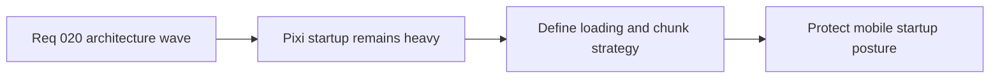

## item_083_define_runtime_loading_and_performance_architecture_for_pixi_mobile_startup_and_chunk_strategy - Define runtime loading and performance architecture for Pixi mobile startup and chunk strategy
> From version: 0.1.2
> Status: Ready
> Understanding: 98%
> Confidence: 95%
> Progress: 0%
> Complexity: High
> Theme: Performance
> Reminder: Update status/understanding/confidence/progress and linked task references when you edit this doc.

# Problem
- The project now suppresses the current Vite chunk-size warning, but the underlying loading and startup posture for Pixi remains an architectural question rather than a solved system.
- Without a deliberate loading and performance architecture, future runtime growth will keep increasing startup cost and mobile risk without a stable design boundary.

# Scope
- In: Startup-loading posture, chunk or lazy-loading strategy, mobile-sensitive startup constraints, and architectural performance boundaries for runtime activation.
- Out: Broad rendering micro-optimizations, asset-pipeline overhaul, or premature implementation of every performance tactic at once.

# Acceptance criteria
- AC1: The slice defines a runtime-loading architecture direction for Pixi startup rather than relying only on warning-threshold changes.
- AC2: The slice defines a chunking or lazy-loading strategy for the runtime boundary.
- AC3: The slice defines mobile-sensitive startup constraints or performance expectations for the initial runtime path.
- AC4: The work remains compatible with the current PWA, static-hosting, and engine-game runtime posture.
- AC5: The slice stays architectural and prioritization-oriented rather than collapsing into broad optimization churn.

# AC Traceability
- AC1 -> Scope: Loading posture is framed architecturally. Proof target: performance architecture notes, loading strategy docs, backlog follow-ups.
- AC2 -> Scope: Chunking or lazy boundaries are explicit. Proof target: planned runtime entry strategy, build notes, Vite follow-up direction.
- AC3 -> Scope: Mobile startup constraints are first-class. Proof target: performance budgets, startup expectations, architecture report.
- AC4 -> Scope: The strategy fits current delivery posture. Proof target: compatibility notes with PWA, static build, runtime runner, CI.
- AC5 -> Scope: The work remains bounded and architectural. Proof target: scope statement, backlog split, follow-up plan.

# Decision framing
- Product framing: Required
- Product signals: conversion journey, engagement loop
- Product follow-up: Keep startup cost aligned with a playable mobile-first product path.
- Architecture framing: Required
- Architecture signals: delivery and operations, runtime and boundaries
- Architecture follow-up: Turn the current bundle-size concern into a deliberate loading architecture instead of a recurring warning discussion.

# Links
- Product brief(s): `prod_003_high_density_top_down_survival_action_direction`
- Architecture decision(s): `adr_002_separate_react_shell_from_pixi_runtime_ownership`
- Request: `req_020_define_the_next_architecture_wave_for_app_state_loading_content_rendering_and_boundary_enforcement`

# Priority
- Impact: High
- Urgency: High

# Notes
- Derived from request `req_020_define_the_next_architecture_wave_for_app_state_loading_content_rendering_and_boundary_enforcement`.
- Source file: `logics/request/req_020_define_the_next_architecture_wave_for_app_state_loading_content_rendering_and_boundary_enforcement.md`.
