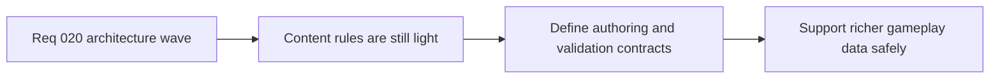

## item_084_define_content_authoring_and_validation_architecture_for_gameplay_world_and_entity_data - Define content authoring and validation architecture for gameplay world and entity data
> From version: 0.1.2
> Status: Ready
> Understanding: 97%
> Confidence: 94%
> Progress: 0%
> Complexity: High
> Theme: Architecture
> Reminder: Update status/understanding/confidence/progress and linked task references when you edit this doc.

# Problem
- The runtime is now better structured than the content model that feeds it.
- Without a stronger content-authoring and validation architecture, gameplay, world, entity, and scenario data will scale through local conventions instead of explicit contracts, which will make future systems brittle.

# Scope
- In: Typed content contracts, id/reference posture, validation strategy, ownership of gameplay/world/entity/scenario data, and compatibility with the current game layer.
- Out: Building a general-purpose content platform, authoring tools UI, or implementing every future gameplay dataset immediately.

# Acceptance criteria
- AC1: The slice defines a content-authoring architecture for gameplay, world, entity, and scenario data.
- AC2: The slice defines an id or reference posture that reduces future cross-file ambiguity and content drift.
- AC3: The slice defines a validation posture for content correctness and compatibility with runtime expectations.
- AC4: The architecture remains pragmatic and Emberwake-focused rather than over-generalizing into a large platform initiative.
- AC5: The work stays compatible with the current game-owned content layer and current validation workflow.

# AC Traceability
- AC1 -> Scope: Content architecture is explicit and scoped. Proof target: content architecture notes, backlog follow-ups, data contracts.
- AC2 -> Scope: Id and reference rules are defined. Proof target: typed ids, validation rules, authoring guidance.
- AC3 -> Scope: Validation posture is explicit. Proof target: test/lint/data-validation strategy, architecture notes.
- AC4 -> Scope: The work remains pragmatic. Proof target: bounded scope, absence of speculative platform abstractions.
- AC5 -> Scope: The architecture fits the current repo posture. Proof target: game-layer compatibility, existing validation commands, docs.

# Decision framing
- Product framing: Required
- Product signals: engagement loop
- Product follow-up: Use content contracts to support denser gameplay and authored systems without losing control of correctness.
- Architecture framing: Required
- Architecture signals: contracts and integration
- Architecture follow-up: Treat content contracts as architecture, not only as implementation detail.

# Links
- Product brief(s): `prod_000_initial_single_entity_navigation_loop`, `prod_003_high_density_top_down_survival_action_direction`
- Architecture decision(s): `adr_015_define_engine_to_game_runtime_contract_boundaries`
- Request: `req_020_define_the_next_architecture_wave_for_app_state_loading_content_rendering_and_boundary_enforcement`

# Priority
- Impact: High
- Urgency: Medium

# Notes
- Derived from request `req_020_define_the_next_architecture_wave_for_app_state_loading_content_rendering_and_boundary_enforcement`.
- Source file: `logics/request/req_020_define_the_next_architecture_wave_for_app_state_loading_content_rendering_and_boundary_enforcement.md`.
