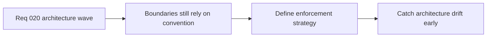

## item_086_define_boundary_enforcement_strategy_for_public_modules_import_rules_and_architecture_regression_checks - Define boundary enforcement strategy for public modules import rules and architecture regression checks
> From version: 0.1.2
> Status: Ready
> Understanding: 98%
> Confidence: 95%
> Progress: 0%
> Complexity: Medium
> Theme: Architecture
> Reminder: Update status/understanding/confidence/progress and linked task references when you edit this doc.

# Problem
- The modular topology is now much healthier, but its long-term durability still depends too much on convention and reviewer memory.
- Without a stronger boundary-enforcement strategy, future work can gradually reintroduce cross-import drift and architecture regressions even if the current structure is clean.

# Scope
- In: Public-module posture, import-rule strategy, architecture-regression checks, and lightweight enforcement that fits the repository.
- Out: Heavyweight governance systems, multi-repo packaging strategy, or enforcement unrelated to the modular architecture.

# Acceptance criteria
- AC1: The slice defines a boundary-enforcement strategy for public modules and import posture across app, engine, and game layers.
- AC2: The slice defines how architecture-regression checks should be expressed, for example through lint rules, tests, CI checks, or equivalent lightweight mechanisms.
- AC3: The strategy remains compatible with the current repository structure and development workflow.
- AC4: The enforcement posture stays lightweight and pragmatic rather than introducing heavy internal platform overhead.
- AC5: The slice explicitly aims to preserve the current modular architecture against future drift.

# AC Traceability
- AC1 -> Scope: Public-module and import posture are explicit. Proof target: architecture notes, lint strategy, module-boundary guidance.
- AC2 -> Scope: Regression checks are defined. Proof target: CI or lint follow-up direction, task plan, architecture docs.
- AC3 -> Scope: The strategy fits the current repo. Proof target: compatibility notes, config plan, low-friction enforcement.
- AC4 -> Scope: Enforcement stays pragmatic. Proof target: bounded tooling posture, absence of heavyweight governance additions.
- AC5 -> Scope: The strategy explicitly protects against drift. Proof target: rationale, regression examples, follow-up checks.

# Decision framing
- Product framing: Consider
- Product signals: engagement loop
- Product follow-up: Keep architecture drift from slowing future product delivery.
- Architecture framing: Required
- Architecture signals: delivery and operations, runtime and boundaries
- Architecture follow-up: Turn current ad hoc boundary protection into a sustained regression-prevention posture.

# Links
- Product brief(s): `prod_000_initial_single_entity_navigation_loop`
- Architecture decision(s): `adr_014_adopt_a_modular_app_engine_game_topology_with_one_way_dependencies`, `adr_015_define_engine_to_game_runtime_contract_boundaries`
- Request: `req_020_define_the_next_architecture_wave_for_app_state_loading_content_rendering_and_boundary_enforcement`

# Priority
- Impact: Medium
- Urgency: Medium

# Notes
- Derived from request `req_020_define_the_next_architecture_wave_for_app_state_loading_content_rendering_and_boundary_enforcement`.
- Source file: `logics/request/req_020_define_the_next_architecture_wave_for_app_state_loading_content_rendering_and_boundary_enforcement.md`.
