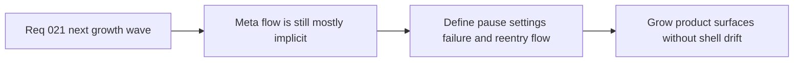

## item_088_define_product_meta_flow_architecture_for_pause_settings_failure_and_runtime_reentry - Define product meta flow architecture for pause settings failure and runtime reentry
> From version: 0.1.2
> Status: Done
> Understanding: 98%
> Confidence: 95%
> Progress: 100%
> Complexity: High
> Theme: Architecture
> Reminder: Update status/understanding/confidence/progress and linked task references when you edit this doc.

# Problem
- The shell-scene model now exists, but the actual product-facing meta-flow around `pause`, `settings`, `failure`, and `runtime re-entry` is still mostly reserved rather than architected end to end.
- Without a deliberate product meta-flow architecture, future surfaces will accumulate as local shell behavior and reintroduce ambiguity between shell state, gameplay signals, persistence, and recovery flow.

# Scope
- In: Product-facing meta-flow, shell-versus-game ownership for pause and failure transitions, runtime re-entry posture, and compatibility with the current app-scene model.
- Out: Full implementation of menus, onboarding, settings UX, or broad shell redesign.

# Acceptance criteria
- AC1: The slice defines an explicit product meta-flow architecture covering at least `pause`, `settings`, `failure`, and `runtime re-entry`.
- AC2: The slice defines ownership between shell scenes, gameplay-owned state or signals, and any persistence or recovery posture needed for re-entry.
- AC3: The resulting flow remains compatible with the current app-scene model, runtime runner, and engine-to-game contract posture.
- AC4: The work reduces the risk of shell-surface growth becoming ad hoc as more product-facing states appear.
- AC5: The slice stays architectural and does not expand into immediate full UX implementation.

# AC Traceability
- AC1 -> Scope: Meta-flow structure is explicit. Proof target: architecture notes, scene-flow definitions, backlog follow-ups.
- AC2 -> Scope: Ownership is clear between shell and gameplay. Proof target: flow model, state ownership notes, task report.
- AC3 -> Scope: The flow fits current runtime architecture. Proof target: compatibility notes with app scenes, runtime runner, and game signals.
- AC4 -> Scope: Shell growth risk is reduced structurally. Proof target: orchestration rules, diagrams, planned ownership boundaries.
- AC5 -> Scope: The work stays architecture-first. Proof target: bounded scope, absence of broad UX implementation churn.

# Decision framing
- Product framing: Required
- Product signals: navigation and discoverability, engagement loop
- Product follow-up: Use the meta-flow model to support player-facing recovery and control surfaces without reopening shell ownership questions.
- Architecture framing: Required
- Architecture signals: runtime and boundaries, contracts and integration
- Architecture follow-up: Capture the product-level flow model before pause, failure, and settings behaviors spread across local shell state.

# Links
- Product brief(s): `prod_000_initial_single_entity_navigation_loop`
- Architecture decision(s): `adr_016_define_shell_scene_state_and_meta_surface_ownership`, `adr_022_keep_product_meta_flow_shell_owned_while_runtime_state_remains_game_preserved`
- Request: `req_021_define_the_next_runtime_product_and_gameplay_system_architecture_wave`
- Primary task(s): `task_029_orchestrate_runtime_performance_product_meta_flow_and_gameplay_system_architecture`

# Priority
- Impact: High
- Urgency: High

# Notes
- Derived from request `req_021_define_the_next_runtime_product_and_gameplay_system_architecture_wave`.
- Source file: `logics/request/req_021_define_the_next_runtime_product_and_gameplay_system_architecture_wave.md`.
- Implemented through `task_029_orchestrate_runtime_performance_product_meta_flow_and_gameplay_system_architecture`.
