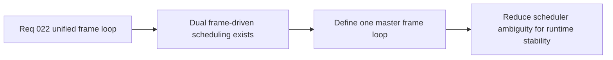

## item_090_define_the_target_master_frame_loop_between_runtime_runner_presentation_and_pixi_render_submission - Define the target master frame loop between runtime runner presentation and Pixi render submission
> From version: 0.1.2
> Status: Ready
> Understanding: 98%
> Confidence: 95%
> Progress: 0%
> Complexity: High
> Theme: Architecture
> Reminder: Update status/understanding/confidence/progress and linked task references when you edit this doc.

# Problem
- The runtime currently relies on separate frame-driven scheduling between the engine-owned runner and the Pixi application ticker.
- Without one explicit master frame loop, update cadence, presentation publication, and render submission can drift in ways that make mild runtime jitter harder to reason about and harder to profile.

# Scope
- In: The target master frame loop, ownership between simulation progression and render scheduling, fixed-step compatibility, and the coordination model between runtime runner, presentation derivation, and Pixi render submission.
- Out: Broad local rendering optimization, content simplification, or full implementation of every future rendering feature.

# Acceptance criteria
- AC1: The slice defines a target master frame loop for coordinating fixed-step simulation, presentation derivation, and Pixi render submission.
- AC2: The slice defines whether engine runtime orchestration or Pixi-driven scheduling owns the authoritative frame clock.
- AC3: The slice preserves compatibility with the current fixed-step simulation guarantees, `GameModule` contract, and shell-owned runtime entry posture.
- AC4: The resulting architecture reduces scheduler ambiguity without turning the engine into a Pixi-specific gameplay runtime.
- AC5: The work stays architecture-focused and does not collapse into unrelated local rendering tweaks.

# AC Traceability
- AC1 -> Scope: The master frame loop is explicit. Proof target: architecture notes, frame-phase model, task report.
- AC2 -> Scope: Clock ownership is explicit. Proof target: scheduling decision, orchestration guidance, follow-up splits.
- AC3 -> Scope: The solution fits the current runtime posture. Proof target: compatibility notes with fixed-step, `GameModule`, and shell boundary.
- AC4 -> Scope: The architecture remains clean. Proof target: ownership model, engine-versus-Pixi notes, bounded design.
- AC5 -> Scope: The slice remains architectural. Proof target: bounded scope, absence of broad optimization churn.

# Decision framing
- Product framing: Required
- Product signals: engagement loop
- Product follow-up: Use one master frame loop to improve runtime smoothness before denser gameplay or rendering layers arrive.
- Architecture framing: Required
- Architecture signals: runtime and boundaries, contracts and integration
- Architecture follow-up: Give the runtime one clear scheduling model rather than letting update and render cadence drift implicitly.

# Links
- Product brief(s): `prod_003_high_density_top_down_survival_action_direction`
- Architecture decision(s): `adr_015_define_engine_to_game_runtime_contract_boundaries`, `adr_019_keep_engine_pixi_as_adapter_and_game_as_runtime_scene_composer`, `adr_021_define_runtime_performance_budgets_and_profiling_at_the_shell_to_runtime_boundary`
- Request: `req_022_define_a_unified_frame_loop_architecture_for_runtime_stability_and_render_scheduling`

# Priority
- Impact: High
- Urgency: High

# Notes
- Derived from request `req_022_define_a_unified_frame_loop_architecture_for_runtime_stability_and_render_scheduling`.
- Source file: `logics/request/req_022_define_a_unified_frame_loop_architecture_for_runtime_stability_and_render_scheduling.md`.
