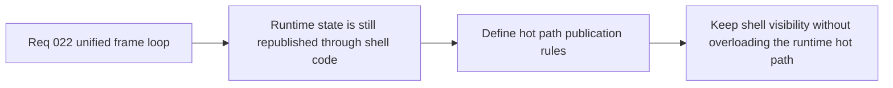

## item_091_define_hot_path_state_publication_rules_between_runtime_shell_and_diagnostics_surfaces - Define hot path state publication rules between runtime shell and diagnostics surfaces
> From version: 0.1.2
> Status: Done
> Understanding: 98%
> Confidence: 95%
> Progress: 100%
> Complexity: High
> Theme: Architecture
> Reminder: Update status/understanding/confidence/progress and linked task references when you edit this doc.

# Problem
- The runtime publishes snapshots through React-facing shell code while Pixi also renders on the hot path.
- Without explicit state-publication rules, shell overlays, diagnostics, and runtime-facing React subscriptions can keep more per-frame work in the hot path than necessary and make loop unification less effective.

# Scope
- In: Rules for what runtime state may be republished through React on the hot path, which shell surfaces need live per-frame data, and how diagnostics or meta surfaces should consume runtime information after loop unification.
- Out: Broad shell redesign, removal of diagnostics, or general UI refactors outside runtime hot-path ownership.

# Acceptance criteria
- AC1: The slice defines hot-path state-publication rules between runtime state, shell surfaces, diagnostics, and equivalent React-facing consumers.
- AC2: The slice defines which shell concerns require live frame-level updates and which should read coarser or event-driven runtime signals instead.
- AC3: The resulting posture remains compatible with the current shell-scene model, diagnostics posture, and runtime ownership boundaries.
- AC4: The work reduces the risk that runtime-loop unification is undermined by unnecessary React publication churn.
- AC5: The slice stays architecture-focused and does not expand into unrelated UI redesign.

# AC Traceability
- AC1 -> Scope: Publication rules are explicit. Proof target: architecture notes, hot-path rules, task report.
- AC2 -> Scope: Live versus coarse updates are separated. Proof target: shell-consumer matrix, diagnostics guidance, follow-up splits.
- AC3 -> Scope: The rules fit current shell ownership. Proof target: compatibility notes with app scenes, diagnostics, and runtime boundaries.
- AC4 -> Scope: React hot-path churn is addressed structurally. Proof target: publication model, bounded state-flow guidance.
- AC5 -> Scope: The slice stays architecture-first. Proof target: bounded scope, absence of broad shell redesign.

# Decision framing
- Product framing: Required
- Product signals: navigation and discoverability, engagement loop
- Product follow-up: Keep shell-facing diagnostics and meta surfaces useful without forcing unnecessary per-frame publication through React.
- Architecture framing: Required
- Architecture signals: runtime and boundaries, delivery and operations
- Architecture follow-up: Define what belongs on the runtime hot path before the unified frame loop lands.

# Links
- Product brief(s): `prod_000_initial_single_entity_navigation_loop`, `prod_003_high_density_top_down_survival_action_direction`
- Architecture decision(s): `adr_016_define_shell_scene_state_and_meta_surface_ownership`, `adr_021_define_runtime_performance_budgets_and_profiling_at_the_shell_to_runtime_boundary`, `adr_022_keep_product_meta_flow_shell_owned_while_runtime_state_remains_game_preserved`, `adr_025_keep_shell_chrome_event_driven_and_sample_diagnostics_off_the_runtime_hot_path`
- Request: `req_022_define_a_unified_frame_loop_architecture_for_runtime_stability_and_render_scheduling`
- Primary task(s): `task_030_orchestrate_unified_frame_loop_architecture_for_runtime_stability_and_render_scheduling`

# Priority
- Impact: Medium
- Urgency: High

# Notes
- Derived from request `req_022_define_a_unified_frame_loop_architecture_for_runtime_stability_and_render_scheduling`.
- Source file: `logics/request/req_022_define_a_unified_frame_loop_architecture_for_runtime_stability_and_render_scheduling.md`.
- Implemented through `task_030_orchestrate_unified_frame_loop_architecture_for_runtime_stability_and_render_scheduling`.
