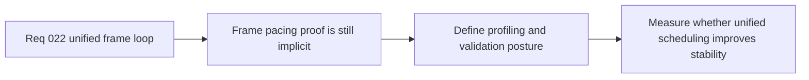

## item_092_define_frame_pacing_profiling_and_validation_for_unified_runtime_scheduling - Define frame pacing profiling and validation for unified runtime scheduling
> From version: 0.1.2
> Status: Done
> Understanding: 98%
> Confidence: 95%
> Progress: 100%
> Complexity: High
> Theme: Performance
> Reminder: Update status/understanding/confidence/progress and linked task references when you edit this doc.

# Problem
- The repository can now validate startup budgets, but it still lacks a clear profiling and validation posture for runtime frame pacing once loop unification work begins.
- Without explicit proof points, the project can refactor scheduling architecture without being able to show whether jitter, frame-time variability, or hot-path contention actually improved.

# Scope
- In: Profiling posture, frame-pacing metrics, local and repeatable validation paths, and the evidence needed to compare the current dual-loop posture against a unified scheduling model.
- Out: Full perf-platform work, generic observability tooling, or broad device-lab automation.

# Acceptance criteria
- AC1: The slice defines a frame-pacing profiling posture for the current runtime and the target unified scheduling model.
- AC2: The slice defines concrete metrics or evidence targets covering at least frame-time variability, scheduler ambiguity, or update-versus-render pacing.
- AC3: The slice defines at least one repeatable repository validation path for runtime scheduling behavior beyond startup-only budgets.
- AC4: The resulting posture remains compatible with the current static frontend, browser smoke discipline, and existing performance-budget workflow.
- AC5: The work stays bounded and does not expand into a generic performance-observability program.

# AC Traceability
- AC1 -> Scope: Profiling posture is explicit. Proof target: profiling notes, task report, validation strategy.
- AC2 -> Scope: Metrics are explicit. Proof target: evidence targets, measurement guidance, follow-up slices.
- AC3 -> Scope: Validation is repeatable. Proof target: repo validation path, smoke or profiling protocol, compatibility notes.
- AC4 -> Scope: The posture fits the current repo. Proof target: compatibility with static frontend, smoke, and budget workflow.
- AC5 -> Scope: The slice stays bounded. Proof target: scope statement, absence of broad observability churn.

# Decision framing
- Product framing: Required
- Product signals: engagement loop
- Product follow-up: Prove runtime smoothness improvements with evidence rather than relying only on subjective feel.
- Architecture framing: Required
- Architecture signals: delivery and operations, runtime and boundaries
- Architecture follow-up: Give loop-unification work a measurable definition of success.

# Links
- Product brief(s): `prod_003_high_density_top_down_survival_action_direction`
- Architecture decision(s): `adr_021_define_runtime_performance_budgets_and_profiling_at_the_shell_to_runtime_boundary`, `adr_026_validate_unified_runtime_scheduling_with_frame_pacing_telemetry_and_browser_smoke`
- Request: `req_022_define_a_unified_frame_loop_architecture_for_runtime_stability_and_render_scheduling`
- Primary task(s): `task_030_orchestrate_unified_frame_loop_architecture_for_runtime_stability_and_render_scheduling`

# Priority
- Impact: High
- Urgency: Medium

# Notes
- Derived from request `req_022_define_a_unified_frame_loop_architecture_for_runtime_stability_and_render_scheduling`.
- Source file: `logics/request/req_022_define_a_unified_frame_loop_architecture_for_runtime_stability_and_render_scheduling.md`.
- Implemented through `task_030_orchestrate_unified_frame_loop_architecture_for_runtime_stability_and_render_scheduling`.
