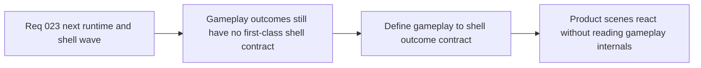

## item_093_define_gameplay_to_shell_outcome_contracts_for_defeat_victory_restart_and_runtime_recovery - Define gameplay-to-shell outcome contracts for defeat, victory, restart, and runtime recovery
> From version: 0.1.2
> Status: Done
> Understanding: 99%
> Confidence: 96%
> Progress: 100%
> Complexity: High
> Theme: Architecture
> Reminder: Update status/understanding/confidence/progress and linked task references when you edit this doc.

# Problem
- The shell now owns product scenes and runtime-entry flow, but the repository still lacks a first-class contract for gameplay outcomes flowing back out of the runtime.
- Without an explicit outcome seam, future features such as defeat, victory, restart, recovery, or soft-lock handling will either leak shell concerns into gameplay internals or force the shell to infer product meaning from low-level runtime state.

# Scope
- In: Outcome contracts between gameplay and shell-owned scenes, ownership of defeat/victory/restart/recovery semantics, and the expected shell reaction model.
- Out: Implementing combat, death loops, reward systems, or broad product UX work.

# Acceptance criteria
- AC1: The slice defines an explicit gameplay-to-shell outcome contract covering at least defeat, victory, restart-needed, and recoverable runtime interruption.
- AC2: The slice defines ownership boundaries between gameplay state, shell scene transitions, and any shared runtime recovery semantics.
- AC3: The slice defines how the shell should consume outcome signals without reading arbitrary game-owned internals.
- AC4: The resulting posture remains compatible with the current shell-owned scene model, runtime boundary, and `GameModule` ownership.
- AC5: The work stays architectural and does not expand into full gameplay feature delivery or shell-UX production work.

# AC Traceability
- AC1 -> Scope: Outcome contract is explicit. Proof target: named outcome model, task report, architecture notes.
- AC2 -> Scope: Ownership boundaries are explicit. Proof target: shell/runtime/game responsibility split.
- AC3 -> Scope: Consumption path is explicit. Proof target: shell reaction model or contract guidance.
- AC4 -> Scope: Existing architecture remains valid. Proof target: compatibility notes with shell scenes and `GameModule`.
- AC5 -> Scope: Slice remains bounded. Proof target: no broad gameplay or UX implementation churn.

# Decision framing
- Product framing: Required
- Product signals: progression and session outcomes
- Product follow-up: Keep defeat, victory, restart, and recovery flows product-readable without coupling shell behavior to raw gameplay internals.
- Architecture framing: Required
- Architecture signals: runtime and boundaries
- Architecture follow-up: Formalize the seam between game-owned meaning and shell-owned scene flow.

# Links
- Product brief(s): `prod_003_high_density_top_down_survival_action_direction`
- Architecture decision(s): `adr_016_define_shell_scene_state_and_meta_surface_ownership`, `adr_022_keep_product_meta_flow_shell_owned_while_runtime_state_remains_game_preserved`, `adr_023_model_gameplay_systems_as_game_owned_state_slices_around_the_game_module`, `adr_027_expose_gameplay_outcomes_as_a_game_owned_shell_consumable_contract`
- Request: `req_023_define_the_next_runtime_shell_render_and_system_boundary_architecture_wave`
- Primary task(s): `task_031_orchestrate_the_remaining_open_architecture_and_runtime_input_reliability_wave`

# Priority
- Impact: High
- Urgency: High

# Notes
- Derived from request `req_023_define_the_next_runtime_shell_render_and_system_boundary_architecture_wave`.
- Source file: `logics/request/req_023_define_the_next_runtime_shell_render_and_system_boundary_architecture_wave.md`.
- Implemented through `task_031_orchestrate_the_remaining_open_architecture_and_runtime_input_reliability_wave`.
