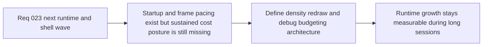

## item_094_define_sustained_runtime_performance_and_render_phase_two_architecture_for_density_redraw_and_debug_budgeting - Define sustained runtime performance and render phase-two architecture for density, redraw, and debug budgeting
> From version: 0.1.2
> Status: Ready
> Understanding: 94%
> Confidence: 91%
> Progress: 0%
> Complexity: High
> Theme: Performance
> Reminder: Update status/understanding/confidence/progress and linked task references when you edit this doc.

# Problem
- The repository now validates startup activation and frame pacing, but it still lacks an architecture posture for sustained runtime cost under prolonged movement, higher density, redraw churn, and debug-heavy rendering.
- Without a phase-two render and performance architecture, the project will keep reacting to spikes after they appear instead of constraining runtime cost through explicit density, redraw, and debug-surface decisions.

# Scope
- In: Sustained runtime performance posture, render phase-two architecture, density and redraw budgeting, debug-visual degradation policy, and long-session runtime cost framing.
- Out: Broad graphics rewrites, generic optimization sweeps, or full asset-pipeline implementation.

# Acceptance criteria
- AC1: The slice defines a sustained runtime performance posture beyond startup-only or first-frame budgets.
- AC2: The slice defines a render phase-two direction covering at least redraw policy, density growth, and debug-surface budgeting.
- AC3: The slice defines how player-facing runtime visuals and debug visuals should be budgeted or degraded differently.
- AC4: The resulting posture remains compatible with the current unified frame loop, Pixi adapter posture, and smoke-budget workflow.
- AC5: The work stays architectural and does not expand into a broad low-level rendering rewrite.

# AC Traceability
- AC1 -> Scope: Sustained runtime posture is explicit. Proof target: budget framing, runtime-cost notes, task report.
- AC2 -> Scope: Render phase-two direction is explicit. Proof target: redraw, density, and debug architecture notes.
- AC3 -> Scope: Player versus debug budgeting is explicit. Proof target: degradation or split-budget guidance.
- AC4 -> Scope: Existing runtime posture remains compatible. Proof target: compatibility with unified frame loop and smoke workflow.
- AC5 -> Scope: Slice remains bounded. Proof target: absence of broad rendering-platform churn.

# Decision framing
- Product framing: Required
- Product signals: readability and runtime smoothness
- Product follow-up: Keep visible runtime quality stable as density, feedback, and debug tooling evolve.
- Architecture framing: Required
- Architecture signals: runtime and boundaries, delivery and operations
- Architecture follow-up: Move from reactive spike handling to an explicit sustained-performance and render-cost posture.

# Links
- Product brief(s): `prod_003_high_density_top_down_survival_action_direction`
- Architecture decision(s): `adr_019_keep_engine_pixi_as_adapter_and_game_as_runtime_scene_composer`, `adr_021_define_runtime_performance_budgets_and_profiling_at_the_shell_to_runtime_boundary`, `adr_024_drive_live_runtime_from_the_pixi_visual_frame_while_engine_keeps_fixed_step_authority`, `adr_026_validate_unified_runtime_scheduling_with_frame_pacing_telemetry_and_browser_smoke`
- Request: `req_023_define_the_next_runtime_shell_render_and_system_boundary_architecture_wave`
- Primary task(s): `task_tbd_orchestrate_the_next_runtime_shell_render_and_system_boundary_architecture_wave`

# Priority
- Impact: High
- Urgency: High

# Notes
- Derived from request `req_023_define_the_next_runtime_shell_render_and_system_boundary_architecture_wave`.
- Source file: `logics/request/req_023_define_the_next_runtime_shell_render_and_system_boundary_architecture_wave.md`.
