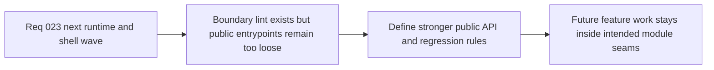

## item_096_define_public_entrypoint_hardening_and_architecture_regression_rules_for_app_engine_and_game_modules - Define public-entrypoint hardening and architecture-regression rules for app, engine, and game modules
> From version: 0.5.0
> Status: Done
> Understanding: 98%
> Confidence: 95%
> Progress: 100%
> Complexity: Medium
> Theme: Architecture
> Reminder: Update status/understanding/confidence/progress and linked task references when you edit this doc.

# Problem
- The repository now has clearer ownership and targeted lint rules, but package and module entrypoints are still not strict enough to reliably prevent deep opportunistic imports and future architecture regressions.
- Without stronger public-entrypoint posture, new feature work can gradually bypass intended boundaries across `app`, `engine-core`, `engine-pixi`, and `games/emberwake`.

# Scope
- In: Public-entrypoint posture, deep-import restrictions, architecture-regression checks, and module-boundary enforcement guidance across app, engine, and game layers.
- Out: Full packaging or publishing changes, monorepo tooling overhauls, or unrelated lint cleanup.

# Acceptance criteria
- AC1: The slice defines a stronger public-entrypoint posture for `app`, `engine-core`, `engine-pixi`, and `games/emberwake`.
- AC2: The slice defines a strategy for detecting or preventing deep imports and comparable architecture-regression patterns.
- AC3: The slice defines how the boundary-enforcement posture should remain practical for daily delivery instead of becoming mostly ceremonial.
- AC4: The resulting posture remains compatible with the current aliasing, lint workflow, and modular runtime architecture.
- AC5: The work stays bounded and does not expand into broad build-system or package-publication restructuring.

# AC Traceability
- AC1 -> Scope: Public entrypoints are explicit. Proof target: entrypoint posture, architecture notes, task report.
- AC2 -> Scope: Regression detection is explicit. Proof target: lint rules, check posture, or follow-up enforcement guidance.
- AC3 -> Scope: Delivery practicality is explicit. Proof target: compatibility notes and bounded enforcement approach.
- AC4 -> Scope: Existing repo workflow remains compatible. Proof target: fit with aliases, lint, and current package structure.
- AC5 -> Scope: Slice remains bounded. Proof target: absence of broad packaging churn.

# Request AC Traceability
- req_023_define_the_next_runtime_shell_render_and_system_boundary_architecture_wave coverage: AC1, AC2, AC3, AC4, AC5, AC6. Proof: `item_096_define_public_entrypoint_hardening_and_architecture_regression_rules_for_app_engine_and_game_modules` remains the request-closing backlog slice for `req_023_define_the_next_runtime_shell_render_and_system_boundary_architecture_wave` and stays linked to `task_031_orchestrate_the_remaining_open_architecture_and_runtime_input_reliability_wave` for delivered implementation evidence.

# Decision framing
- Product framing: Supporting
- Product signals: delivery throughput
- Product follow-up: Keep product velocity from eroding architecture quality as more systems land.
- Architecture framing: Required
- Architecture signals: runtime and boundaries, delivery and operations
- Architecture follow-up: Make intended module seams durable instead of advisory.

# Links
- Product brief(s): `prod_003_high_density_top_down_survival_action_direction`
- Architecture decision(s): `adr_015_define_engine_to_game_runtime_contract_boundaries`, `adr_020_enforce_architecture_boundaries_with_targeted_module_scoped_lint_rules`, `adr_030_harden_public_package_entrypoints_with_targeted_deep_import_rules`
- Request: `req_023_define_the_next_runtime_shell_render_and_system_boundary_architecture_wave`
- Primary task(s): `task_031_orchestrate_the_remaining_open_architecture_and_runtime_input_reliability_wave`

# Priority
- Impact: Medium
- Urgency: Medium

# Notes
- Derived from request `req_023_define_the_next_runtime_shell_render_and_system_boundary_architecture_wave`.
- Source file: `logics/request/req_023_define_the_next_runtime_shell_render_and_system_boundary_architecture_wave.md`.
- Implemented through `task_031_orchestrate_the_remaining_open_architecture_and_runtime_input_reliability_wave`.
