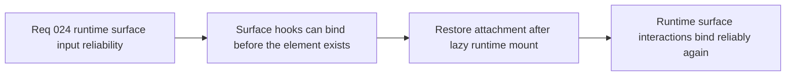

## item_097_restore_surface_bound_interaction_hooks_to_attach_after_lazy_runtime_mount - Restore surface-bound interaction hooks to attach after lazy runtime mount
> From version: 0.1.2
> Status: Ready
> Understanding: 97%
> Confidence: 95%
> Progress: 0%
> Complexity: Medium
> Theme: Quality
> Reminder: Update status/understanding/confidence/progress and linked task references when you edit this doc.

# Problem
- Several runtime-surface interaction hooks currently bind listeners assuming the surface element exists during the initial effect pass.
- Under lazy runtime mount, that assumption can fail, which leaves the actual Pixi surface without the listeners needed for joystick, diagnostics, or camera-local interactions.

# Scope
- In: Restoring reliable listener attachment for hooks that subscribe to the runtime surface element after delayed mount.
- Out: Broad input redesign, new control schemes, or unrelated runtime interaction changes.

# Acceptance criteria
- AC1: The slice defines or implements a reliable attachment posture for surface-bound hooks when the runtime surface appears after shell mount.
- AC2: The slice explicitly covers the hooks that bind to the runtime surface for joystick and comparable interaction paths.
- AC3: The resulting posture remains compatible with the lazy runtime boundary and current shell-owned runtime model.
- AC4: The work stays bounded and does not expand into broad input-ownership redesign.

# AC Traceability
- AC1 -> Scope: Attachment reliability is explicit. Proof target: hook behavior notes, task report, or code path update.
- AC2 -> Scope: Affected hooks are covered. Proof target: slice notes and referenced files.
- AC3 -> Scope: Existing architecture remains valid. Proof target: compatibility notes with lazy mount and shell ownership.
- AC4 -> Scope: Slice remains narrow. Proof target: no unrelated control-model churn.

# Decision framing
- Product framing: Supporting
- Product signals: input responsiveness
- Product follow-up: Restore reliable control response after the runtime surface appears.
- Architecture framing: Required
- Architecture signals: runtime and boundaries
- Architecture follow-up: Make surface-bound effects robust against delayed surface availability.

# Links
- Product brief(s): `prod_000_initial_single_entity_navigation_loop`
- Architecture decision(s): `adr_017_lazy_load_pixi_runtime_behind_a_shell_owned_boot_boundary`, `adr_024_drive_live_runtime_from_the_pixi_visual_frame_while_engine_keeps_fixed_step_authority`
- Request: `req_024_restore_runtime_surface_input_binding_reliability_after_lazy_mount`
- Primary task(s): `task_tbd_orchestrate_runtime_surface_input_binding_reliability_after_lazy_mount`

# Priority
- Impact: High
- Urgency: High

# Notes
- Derived from request `req_024_restore_runtime_surface_input_binding_reliability_after_lazy_mount`.
- Source file: `logics/request/req_024_restore_runtime_surface_input_binding_reliability_after_lazy_mount.md`.
