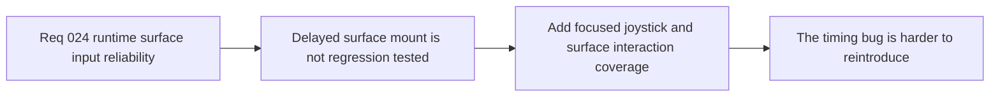

## item_098_add_regression_coverage_for_mobile_joystick_and_surface_interactions_after_delayed_surface_availability - Add regression coverage for mobile joystick and surface interactions after delayed surface availability
> From version: 0.1.2
> Status: Ready
> Understanding: 96%
> Confidence: 94%
> Progress: 0%
> Complexity: Medium
> Theme: Quality
> Reminder: Update status/understanding/confidence/progress and linked task references when you edit this doc.

# Problem
- The runtime currently lacks focused automated coverage proving that mobile joystick and related surface interactions still work when the runtime surface becomes available after an initial null ref pass.
- Without that regression coverage, the same lazy-mount timing bug can reappear unnoticed in future runtime or shell refactors.

# Scope
- In: Automated regression coverage for delayed surface availability, joystick interaction continuity, and related surface-bound interaction paths.
- Out: Full browser-device lab coverage, broad end-to-end input suites, or general gameplay testing.

# Acceptance criteria
- AC1: The slice defines or adds automated regression coverage for delayed runtime-surface availability.
- AC2: The slice explicitly proves that the mobile joystick still works after the runtime surface becomes available late.
- AC3: The slice includes at least one adjacent surface-interaction proof so the bug is not treated as joystick-only if the attachment pattern is shared.
- AC4: The resulting coverage remains lightweight and compatible with the current repo test stack.
- AC5: The work stays bounded and does not expand into a broad e2e input campaign.

# AC Traceability
- AC1 -> Scope: Delayed-mount coverage is explicit. Proof target: test files or validation notes.
- AC2 -> Scope: Joystick regression is covered. Proof target: joystick-specific assertion path.
- AC3 -> Scope: Shared attachment risk is covered. Proof target: one adjacent interaction proof.
- AC4 -> Scope: Repo compatibility is explicit. Proof target: fit with current Vitest or smoke workflow.
- AC5 -> Scope: Slice remains focused. Proof target: no broad test-program expansion.

# Decision framing
- Product framing: Supporting
- Product signals: input responsiveness
- Product follow-up: Prevent an obvious player-facing control regression from reappearing silently.
- Architecture framing: Supporting
- Architecture signals: delivery and operations
- Architecture follow-up: Make lazy-mount interaction reliability measurable instead of assumed.

# Links
- Product brief(s): `prod_000_initial_single_entity_navigation_loop`
- Architecture decision(s): `adr_017_lazy_load_pixi_runtime_behind_a_shell_owned_boot_boundary`, `adr_025_keep_shell_chrome_event_driven_and_sample_diagnostics_off_the_runtime_hot_path`
- Request: `req_024_restore_runtime_surface_input_binding_reliability_after_lazy_mount`
- Primary task(s): `task_tbd_orchestrate_runtime_surface_input_binding_reliability_after_lazy_mount`

# Priority
- Impact: High
- Urgency: High

# Notes
- Derived from request `req_024_restore_runtime_surface_input_binding_reliability_after_lazy_mount`.
- Source file: `logics/request/req_024_restore_runtime_surface_input_binding_reliability_after_lazy_mount.md`.
