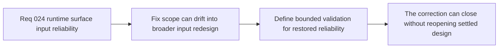

## item_099_validate_runtime_surface_input_reliability_without_reopening_input_ownership_design - Validate runtime surface input reliability without reopening input ownership design
> From version: 0.1.2
> Status: Done
> Understanding: 99%
> Confidence: 97%
> Progress: 100%
> Complexity: Low
> Theme: Quality
> Reminder: Update status/understanding/confidence/progress and linked task references when you edit this doc.

# Problem
- The correction wave needs explicit validation that runtime surface input is reliable again, but it should not sprawl into a broader redesign of control ownership or touch-input semantics.
- Without a bounded validation slice, the team can either under-validate the fix or reopen settled architecture questions that are unrelated to the regression.

# Scope
- In: Targeted validation posture for the correction, proof that the restored behavior fits the current input-ownership model, and non-regression checks aligned with the existing repo workflow.
- Out: Re-architecting input ownership, adding new control semantics, or broad usability tuning.

# Acceptance criteria
- AC1: The slice defines a bounded validation posture for confirming runtime surface input reliability after the correction.
- AC2: The slice explicitly verifies the fix within the current input-ownership model instead of proposing a broader redesign.
- AC3: The slice defines how the correction should be considered done from a repository validation standpoint.
- AC4: The work stays narrow and does not turn into a larger touch-input or UX architecture wave.

# AC Traceability
- AC1 -> Scope: Validation posture is explicit. Proof target: validation notes, task report, or repo checks.
- AC2 -> Scope: Existing ownership model stays intact. Proof target: compatibility statement and absence of redesign churn.
- AC3 -> Scope: Done condition is explicit. Proof target: named validation path.
- AC4 -> Scope: Slice remains bounded. Proof target: no broader input-wave expansion.

# Decision framing
- Product framing: Supporting
- Product signals: control reliability
- Product follow-up: Close the regression cleanly without stalling delivery in a broader design discussion.
- Architecture framing: Supporting
- Architecture signals: delivery and operations
- Architecture follow-up: Keep corrective work aligned with the already-converged shell/runtime ownership model.

# Links
- Product brief(s): `prod_000_initial_single_entity_navigation_loop`
- Architecture decision(s): `adr_016_define_shell_scene_state_and_meta_surface_ownership`, `adr_017_lazy_load_pixi_runtime_behind_a_shell_owned_boot_boundary`, `adr_031_bind_runtime_surface_interactions_to_resolved_elements_after_lazy_mount`
- Request: `req_024_restore_runtime_surface_input_binding_reliability_after_lazy_mount`
- Primary task(s): `task_031_orchestrate_the_remaining_open_architecture_and_runtime_input_reliability_wave`

# Priority
- Impact: Medium
- Urgency: High

# Notes
- Derived from request `req_024_restore_runtime_surface_input_binding_reliability_after_lazy_mount`.
- Source file: `logics/request/req_024_restore_runtime_surface_input_binding_reliability_after_lazy_mount.md`.
- Implemented through `task_031_orchestrate_the_remaining_open_architecture_and_runtime_input_reliability_wave`.
