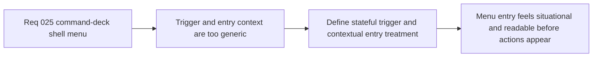

## item_100_define_stateful_shell_menu_trigger_and_context_header_for_runtime_status - Define a stateful shell-menu trigger and context header for runtime status
> From version: 0.2.2
> Status: Done
> Understanding: 100%
> Confidence: 97%
> Progress: 100% (docs synced)
> Complexity: Medium
> Theme: UX
> Reminder: Update status/understanding/confidence/progress and linked task references when you edit this doc.

# Problem
- The current top-right shell trigger is functionally correct but too generic: it reads as a static `Menu` affordance rather than a runtime-aware control surface.
- Once the panel opens, the user needs immediate state context before parsing actions, whether that comes from a header, status band, or equivalent first-entry surface.

# Scope
- In: Defining the stateful trigger posture, the opened-menu entry-context treatment, status wording, and how runtime or shell state should surface visually before the action list.
- Out: Full menu restructuring, detailed button taxonomy for every command, or broader HUD redesign.

# Acceptance criteria
- AC1: The slice defines a stateful shell-menu trigger posture that communicates runtime or shell context more clearly than the current static menu trigger.
- AC2: The slice defines a contextual header, status band, or equivalent first-entry treatment inside the opened menu before the action groups.
- AC3: The slice defines how states such as live runtime, paused runtime, settings scene, and recovery or retry posture should map to trigger and opened-menu state messaging.
- AC4: The slice remains compatible with the current shell-owned scene model and does not reopen runtime ownership or scene-state architecture.

# AC Traceability
- AC1 -> Scope: Trigger posture is explicit. Proof target: trigger behavior notes, UI spec notes, or implemented copy/state mapping.
- AC2 -> Scope: Entry context is explicit. Proof target: header spec, first-entry module, or rendered component structure.
- AC3 -> Scope: State mapping is explicit. Proof target: named state-to-label mapping.
- AC4 -> Scope: Existing ownership remains valid. Proof target: compatibility notes and absence of architecture churn.

# Decision framing
- Product framing: Primary
- Product signals: clarity and control confidence
- Product follow-up: Make the first interaction with the shell menu explain the current runtime situation before the user reads command rows.
- Architecture framing: Supporting
- Architecture signals: shell scene ownership
- Architecture follow-up: Reuse existing shell scene state instead of inventing a parallel UI state model.

# Links
- Product brief(s): `prod_001_minimal_overlay_and_feedback_for_early_runtime`
- Architecture decision(s): `adr_002_separate_react_shell_from_pixi_runtime_ownership`, `adr_016_define_shell_scene_state_and_meta_surface_ownership`, `adr_022_keep_product_meta_flow_shell_owned_while_runtime_state_remains_game_preserved`
- Request: `req_025_define_a_command_deck_shell_menu_and_button_hierarchy_for_runtime_option_b`
- Primary task(s): `task_032_orchestrate_command_deck_shell_menu_option_b_for_runtime_controls`

# Priority
- Impact: High
- Urgency: Medium

# Notes
- Derived from request `req_025_define_a_command_deck_shell_menu_and_button_hierarchy_for_runtime_option_b`.
- Source file: `logics/request/req_025_define_a_command_deck_shell_menu_and_button_hierarchy_for_runtime_option_b.md`.
- Implemented through `task_032_orchestrate_command_deck_shell_menu_option_b_for_runtime_controls`.
- The shell menu trigger and opened-menu first-entry treatment now derive explicit runtime-state copy from the existing shell scene model so the deck communicates `Live`, `Paused`, `Settings`, recovery, boot, and failure posture before command rows are parsed.
- A later refinement removed the separate intro card, so the delivered state context now lives in the stateful trigger plus the `Current action` module rather than a standalone header panel.
