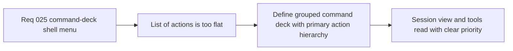

## item_101_define_command_deck_grouping_and_primary_action_hierarchy_for_shell_menu_option_b - Define command-deck grouping and primary action hierarchy for shell menu Option B
> From version: 0.2.1
> Status: Done
> Understanding: 99%
> Confidence: 96%
> Progress: 100%
> Complexity: Medium
> Theme: UX
> Reminder: Update status/understanding/confidence/progress and linked task references when you edit this doc.

# Problem
- The current shell menu exposes the right actions, but the list is too flat: session actions, view controls, and debug utilities all compete with nearly the same visual and semantic weight.
- Without a clearer command hierarchy, the shell feels like a technically correct list of controls rather than a deliberate runtime command deck.

# Scope
- In: Defining explicit menu sections, the primary current-state command, the distinction between primary, secondary, and utility actions, and the re-presentation of existing shell menu actions under that hierarchy.
- Out: Trigger-state design, mobile sheet-specific layout rules, or unrelated gameplay and settings IA changes.

# Acceptance criteria
- AC1: The slice defines a grouped menu information architecture, including distinct `Session`, `View`, and `Tools` families or an equivalent explicit grouping model.
- AC2: The slice defines a visually and behaviorally emphasized primary current-state action such as `Pause`, `Resume`, or `Retry`.
- AC3: The slice defines how existing commands such as settings, reset camera, camera mode, fullscreen, diagnostics, inspecteur, and install are repositioned under the new hierarchy without losing access.
- AC4: The slice defines a stronger distinction between player-facing shell actions and lower-priority debug or utility controls.
- AC5: The work remains a shell UX refinement and does not reopen broader architecture or gameplay HUD design.

# AC Traceability
- AC1 -> Scope: Grouping is explicit. Proof target: menu IA notes, component structure, or task report.
- AC2 -> Scope: Primary action is explicit. Proof target: CTA definition and current-state mapping.
- AC3 -> Scope: Existing commands remain represented. Proof target: action inventory mapped to sections.
- AC4 -> Scope: Priority distinction is explicit. Proof target: utility section or lower-priority treatment notes.
- AC5 -> Scope: Slice remains bounded. Proof target: absence of unrelated HUD or architecture expansion.

# Decision framing
- Product framing: Primary
- Product signals: usability and action readability
- Product follow-up: Make the shell menu guide the user toward the right action instead of asking them to parse a flat control list.
- Architecture framing: Supporting
- Architecture signals: shell chrome and debug gating
- Architecture follow-up: Preserve the current menu-driven shell surface while improving its command hierarchy.

# Links
- Product brief(s): `prod_001_minimal_overlay_and_feedback_for_early_runtime`
- Architecture decision(s): `adr_002_separate_react_shell_from_pixi_runtime_ownership`, `adr_022_keep_product_meta_flow_shell_owned_while_runtime_state_remains_game_preserved`, `adr_025_keep_shell_chrome_event_driven_and_sample_diagnostics_off_the_runtime_hot_path`
- Request: `req_025_define_a_command_deck_shell_menu_and_button_hierarchy_for_runtime_option_b`
- Primary task(s): `task_032_orchestrate_command_deck_shell_menu_option_b_for_runtime_controls`

# Priority
- Impact: High
- Urgency: Medium

# Notes
- Derived from request `req_025_define_a_command_deck_shell_menu_and_button_hierarchy_for_runtime_option_b`.
- Source file: `logics/request/req_025_define_a_command_deck_shell_menu_and_button_hierarchy_for_runtime_option_b.md`.
- Implemented through `task_032_orchestrate_command_deck_shell_menu_option_b_for_runtime_controls`.
- The shell menu now groups controls into `Session`, `View`, and `Tools`, exposes a state-aware primary CTA for `Pause`, `Resume`, or `Retry runtime`, and relegates diagnostics and inspection to a lower-priority tools band without losing access.
