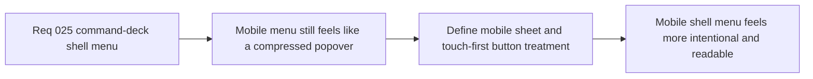

## item_102_define_mobile_sheet_presentation_and_button_treatment_for_shell_menu_option_b - Define mobile sheet presentation and button treatment for shell menu Option B
> From version: 0.2.1
> Status: Draft
> Understanding: 95%
> Confidence: 92%
> Progress: 0%
> Complexity: Medium
> Theme: UX
> Reminder: Update status/understanding/confidence/progress and linked task references when you edit this doc.

# Problem
- The current floating-menu posture works on mobile, but it still reads like a desktop popover compressed into a narrow viewport rather than a mobile-native command surface.
- Button sizing and panel treatment do not yet fully capitalize on a sheet posture that would improve readability, touch comfort, and separation between primary and utility actions on constrained screens.

# Scope
- In: Defining the opened-menu mobile posture as a sheet, touch-target treatment for command rows and segmented controls, and breakpoint-aware presentation differences between desktop and mobile.
- Out: Moving the persistent trigger, redesigning the whole shell layout, or changing the underlying set of menu actions.

# Acceptance criteria
- AC1: The slice defines a mobile-specific opened-menu posture that behaves more like a sheet than a desktop popover.
- AC2: The slice defines button and row treatment for mobile touch interaction, including sufficient emphasis and hit area for the primary action.
- AC3: The slice defines how camera-mode segmented controls or equivalent multi-choice controls should adapt on mobile.
- AC4: The slice keeps the top-right trigger stable while changing only the opened-menu presentation on constrained viewports.
- AC5: The resulting posture remains compatible with the existing shell-owned overlay model and menu-driven access to diagnostics and inspection.

# AC Traceability
- AC1 -> Scope: Mobile posture is explicit. Proof target: breakpoint notes, component notes, or implemented layout rules.
- AC2 -> Scope: Touch treatment is explicit. Proof target: row sizing and button hierarchy notes.
- AC3 -> Scope: Mobile multi-choice handling is explicit. Proof target: segmented-control or equivalent adaptation notes.
- AC4 -> Scope: Trigger posture stays stable. Proof target: viewport-specific behavior statement.
- AC5 -> Scope: Existing shell model remains valid. Proof target: compatibility notes with shell-owned overlays.

# Decision framing
- Product framing: Primary
- Product signals: mobile usability and visual confidence
- Product follow-up: Make the shell menu feel designed for handheld runtime interaction rather than tolerated on it.
- Architecture framing: Supporting
- Architecture signals: responsive shell overlay posture
- Architecture follow-up: Adapt presentation by breakpoint without reopening shell ownership.

# Links
- Product brief(s): `prod_001_minimal_overlay_and_feedback_for_early_runtime`
- Architecture decision(s): `adr_002_separate_react_shell_from_pixi_runtime_ownership`, `adr_016_define_shell_scene_state_and_meta_surface_ownership`, `adr_025_keep_shell_chrome_event_driven_and_sample_diagnostics_off_the_runtime_hot_path`
- Request: `req_025_define_a_command_deck_shell_menu_and_button_hierarchy_for_runtime_option_b`
- Primary task(s): None yet

# Priority
- Impact: Medium
- Urgency: Medium

# Notes
- Derived from request `req_025_define_a_command_deck_shell_menu_and_button_hierarchy_for_runtime_option_b`.
- Source file: `logics/request/req_025_define_a_command_deck_shell_menu_and_button_hierarchy_for_runtime_option_b.md`.
