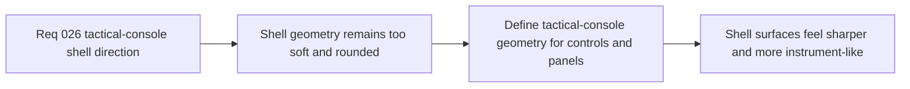

## item_103_define_tactical_console_geometry_for_shell_buttons_panels_and_state_chips - Define tactical-console geometry for shell buttons, panels, and state chips
> From version: 0.2.1
> Status: Draft
> Understanding: 96%
> Confidence: 94%
> Progress: 0%
> Complexity: Medium
> Theme: UX
> Reminder: Update status/understanding/confidence/progress and linked task references when you edit this doc.

# Problem
- The current shell still relies too heavily on rounded capsule geometry, which makes the command deck feel softer and more generic than the intended Emberwake runtime posture.
- Without a deliberate geometry pass, panels, buttons, and state chips remain visually tied to a pill-heavy glass aesthetic rather than a sharper tactical-console language.

# Scope
- In: Defining lower-radius geometry, edge treatment, panel framing, and state-chip form for the shell menu and related shell controls.
- Out: Rewriting shell interaction architecture, redefining command grouping, or changing gameplay HUD structure.

# Acceptance criteria
- AC1: The slice defines a tactical-console geometry posture for shell buttons, panels, and state chips.
- AC2: The slice explicitly reduces the current pill-heavy visual language through lower radii and stronger edge treatment.
- AC3: The slice defines how shell panels and key state chips should present structure and emphasis without depending mainly on blur or softness.
- AC4: The work remains a visual-language refinement and does not reopen shell ownership or command-deck IA.

# AC Traceability
- AC1 -> Scope: Geometry posture is explicit. Proof target: component notes, CSS direction, or implementation report.
- AC2 -> Scope: Rounded-pill reduction is explicit. Proof target: radius or shape treatment notes.
- AC3 -> Scope: Panels and chips are covered. Proof target: panel and state-chip treatment notes.
- AC4 -> Scope: Slice remains bounded. Proof target: no IA or ownership redesign.

# Decision framing
- Product framing: Primary
- Product signals: visual identity and control confidence
- Product follow-up: Make the shell feel like a tactical interface rather than a generic polished overlay.
- Architecture framing: Supporting
- Architecture signals: shell chrome
- Architecture follow-up: Preserve the command-deck model while upgrading its geometry language.

# Links
- Product brief(s): `prod_001_minimal_overlay_and_feedback_for_early_runtime`
- Architecture decision(s): `adr_002_separate_react_shell_from_pixi_runtime_ownership`, `adr_016_define_shell_scene_state_and_meta_surface_ownership`, `adr_025_keep_shell_chrome_event_driven_and_sample_diagnostics_off_the_runtime_hot_path`
- Request: `req_026_define_a_tactical_console_visual_direction_for_shell_controls_and_menus`
- Primary task(s): None yet

# Priority
- Impact: High
- Urgency: Medium

# Notes
- Derived from request `req_026_define_a_tactical_console_visual_direction_for_shell_controls_and_menus`.
- Source file: `logics/request/req_026_define_a_tactical_console_visual_direction_for_shell_controls_and_menus.md`.
